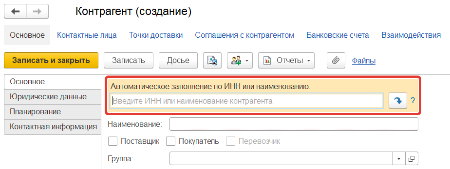
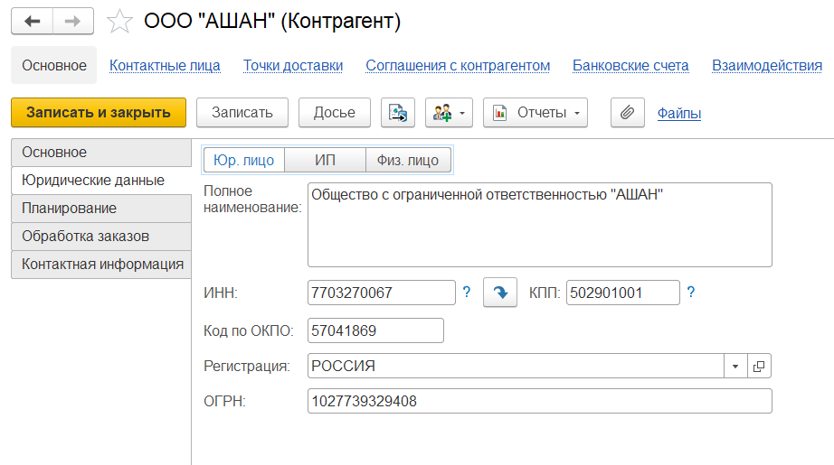
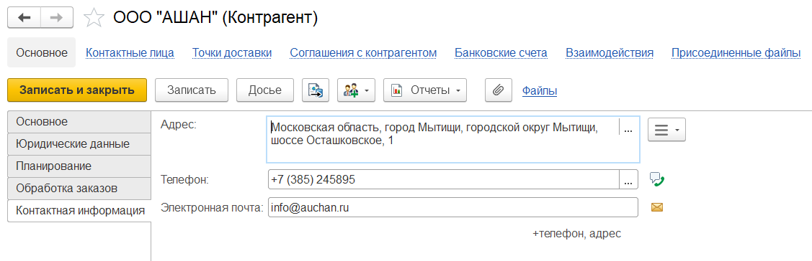

# Контрагенты

Справочник **"Контрагенты"** содержит информацию обо всех клиентах компании.

Элементы справочника могут быть заполнены вручную или загружены по ИНН или наименованию (если подключена интернет поддержка и установлен признак *"Автоматически проверять контрагентов по ЕГРН"*).

**Вкладка "Основное"**

![2]

- Наименование
- Поставщик/покупатель/перевозчик (можно выбрать несколько)
- Группа (используется для разделения контрагентов в справочнике)
- Канал сбыта (выбирается из справочника "Каналы сбыта") используется для классификации конрагентов, анализа продаж
- Код (заполняется автоматически, служит для идентификации контрагента в системе)
- Основной банковский счет. Если у контрагента в системе есть несколько банковских счетов, то можно указать основной. В документах он будет подставляться автоматически. Указывается из справочника "Банковские счета"
- Дополнительная информация (любая дополнительная информация)

**Вкладка "Юридические данные"**

- Юр. лицо/ИП/Физ. лицо - вид организации
- Полное наименование (используется в печатных формах)
- ИНН
- КПП
- Код по ОКПО
- Регистрация. Страна регистрации контрагента. Выбирается из справочника "Страны мира"
- ОГРН
- Рег. номер. Регистрационный номер, присвоенный иностранной организации в стране регистрации (инкорпорация). Указывается, если регистрация - не Россия

**Вкладка "Планирование"**

![4]

- Группа планирования. Указывается группа планирования из справочника "Группы партнеров для планирования". Используется для планирования продаж
- [Холдинг](Holding.md). Указывается из справочника "Холдинги". Служит для объединения контрагентов
- Основной менеджер
- Разрешенный % ОСГ - минимальный ОСГ номенклатуры, который разрешен для отгрузки данному контрагенту

**Вкладка "Контактная информация"**

- Адрес
- Телефон
- Электронная почта
- Фактический адрес
- Юридический адрес

Также для каждого контрагента можно указать:

- Контактные лица контрагента - контактная информация о представителях контрагента. Указывается из справочника "Контактные лица контаргентов"
- [Точки доставки](DeliveryPoint.md)
- [Соглашения с контрагенотом](/docs/CRM/CustomerService/Pricing/AgreementsWithContractors.md) 
- Банковские счета (помимо основного счета у контрагента могут быть другие счета в этом и/или другом банках)
- Взаимодействия
- Настройки дополнительных реквизитов ЭПД
- Присоединенные файлы (можно прикрепить внешние файлы, которые относятся к данному контрагенту)
- Пункты сборки
- Сорта поставщиков

[2]: Contractor.assets/2.png
[4]: Contractor.assets/4.png