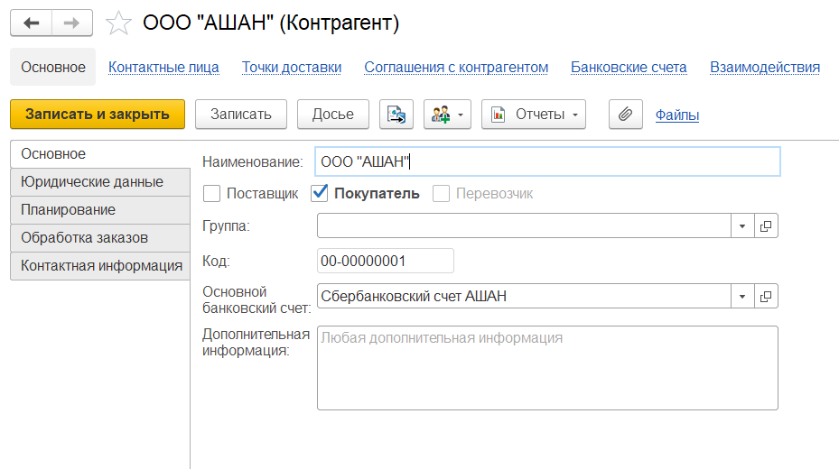
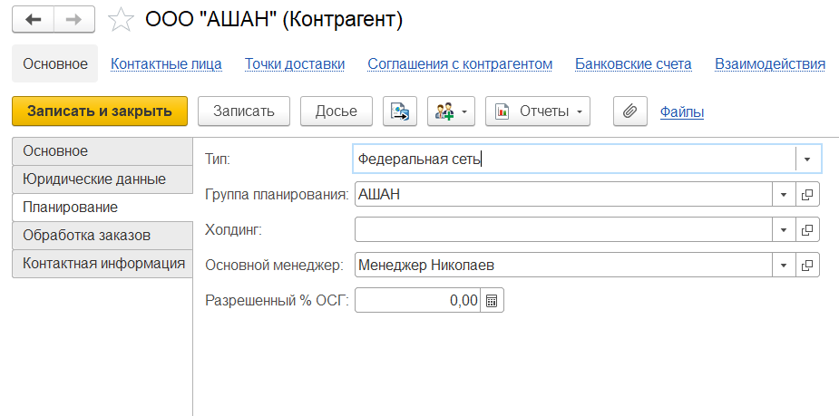

# Контрагенты

Справочник **"Контрагенты"** содержит информацию обо всех клиентах компании.

Элементы справочника могут быть заполнены вручную или загружены по ИНН или наименованию (если подключена интернет поддержка и установлен признак *"Автоматически проверять контрагентов по ЕГРН"*).

**Вкладка "Основное"**

- Наименование
- Поставщик/покупатель/перевозчик (можно выбрать несколько)
- Код (заполняется автоматически)
- Основной банковский счет
- Дополнительная информация

**Вкладка "Юридические данные"**

- Юр. лицо/ИП/Физ. лицо
- Полное наименование
- ИНН
- КПП
- Код по ОКПО
- Регистрация - указывается страна регистрации контрагента
- ОГРН

**Вкладка "Планирование"**

- Тип: локальная точка, локальная сеть, дистрибутор, федеральная сеть
- Группа планирования
- [Холдинг](Holding.md)
- Основной менеджер
- Разрешенный % ОСГ -  разрешенный остаточный срок годности в %

**Вкладка "Контактная информация"**

- Адрес
- Телефон
- Электронная почта
- Фактический адрес
- Юридический адрес

Также для каждого контрагента можно указать:

- Банковские счета (помимо основного счета у контрагента могут быть другие счета в этом и/или другом банках)
- Контактные лица контрагента
- [Точки доставки](DeliveryPoint.md)