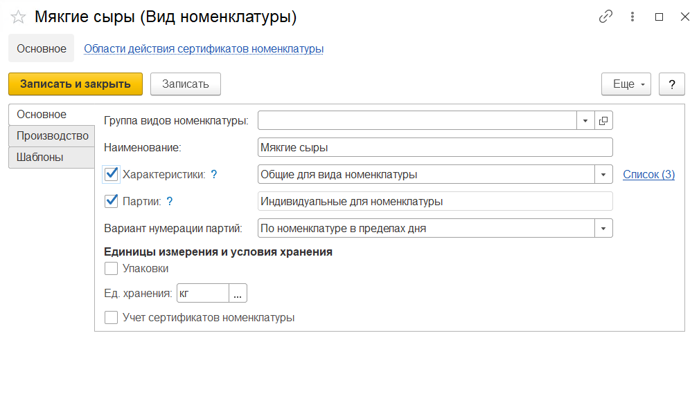
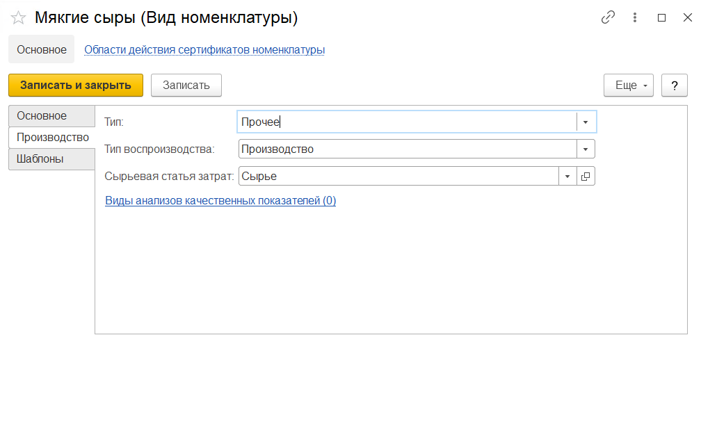
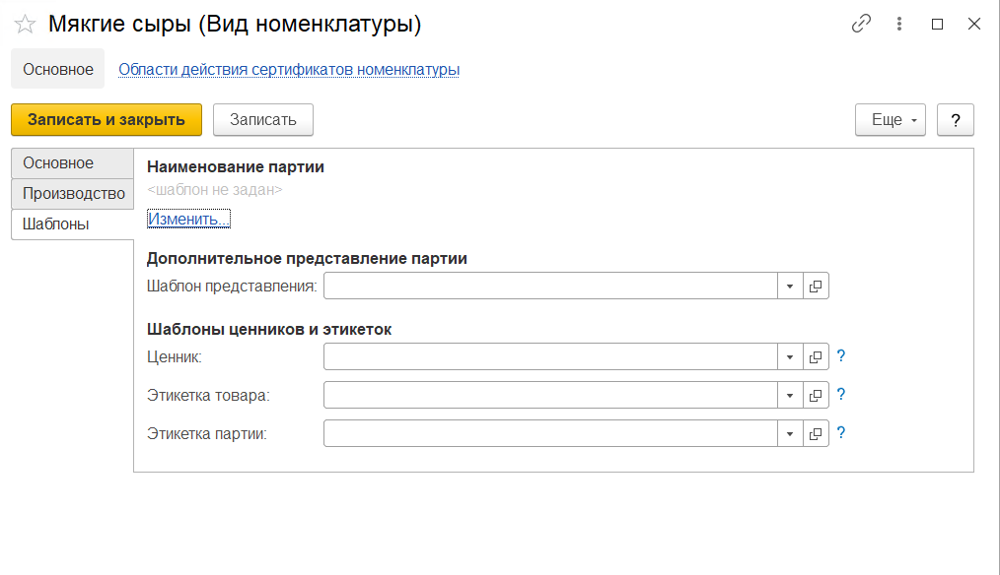

# Виды номенклатуры

Справочник **"Виды номенклатуры"** предназначен для группировки продаваемых товаров по ассортименту. Виды номенклатуры объединяют номенклатуру по общим признакам учета, таким как учет по характеристикам и сериям.

**Вкладка "Основное"**

- Группа видов номенклатуры
- Наименование
- Использование характеристик : индивидуальные для номенклатуры, общие для вида номенклатуры
- Использование серий
- Вариант нумерации серий: по номенклатуре в пределах дня, по номенклатуре в пределах года
- Использование упаковок: индивидуальный набор, общий набор
- Единица хранения

**Вкладка "Производство"**

- Участие в балансе жира и белка
- Тип: пакет, прочее, сырье и материалы
- Тип воспроизводства: производство, покупка
- Сырьевая статья затрат
- Гиперссылка на Виды анализов качественных показателей - доступна, если включен учет по сериям - определяет набор видов анализов, выполняемых по данному виду номенклатуры

**Вкладка "Шаблоны"**

Видна, если включен учет по сериям.

В шаблоне задается вид серий номенклатуры.