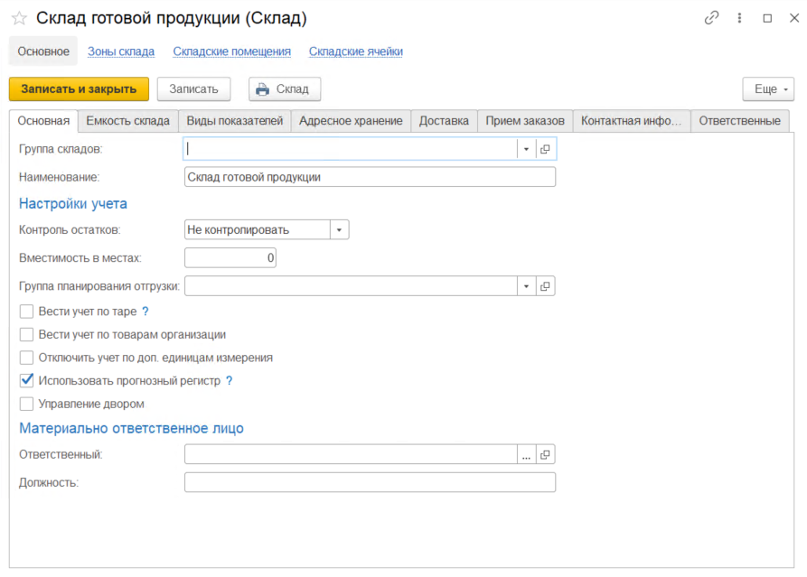
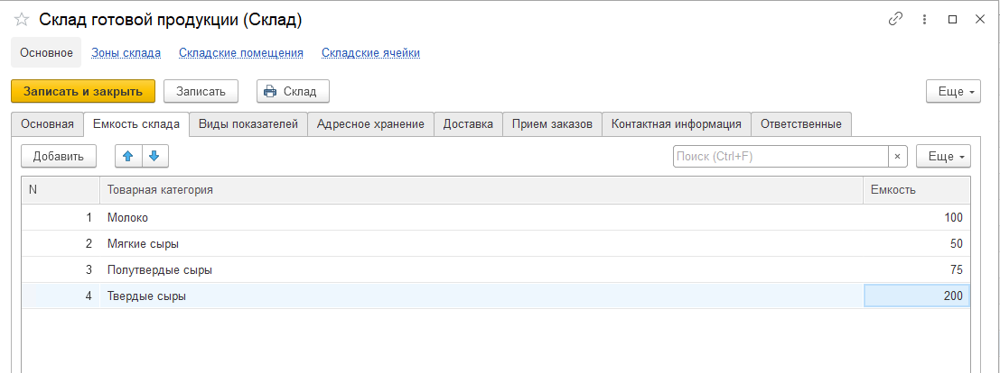
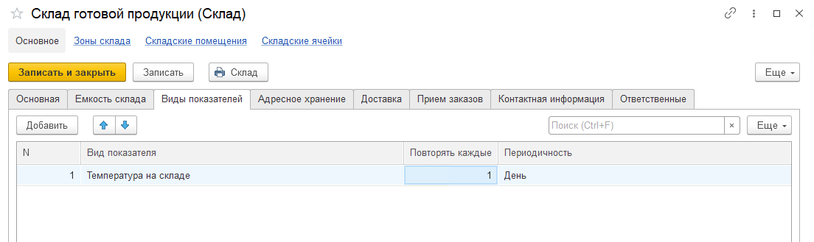
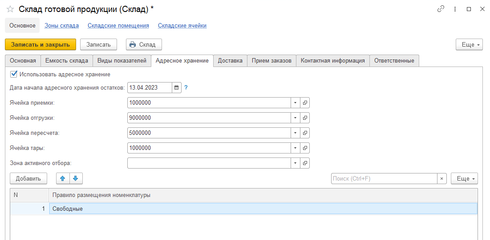
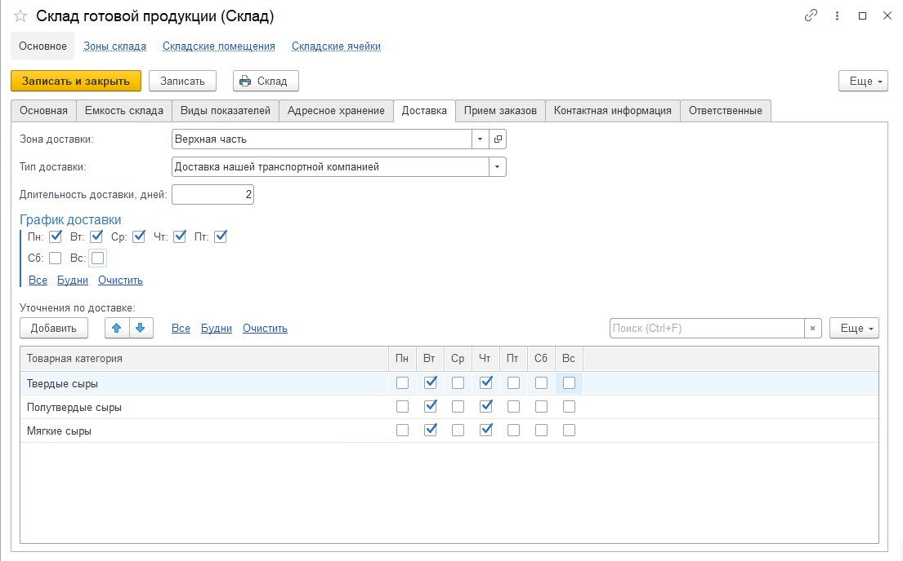
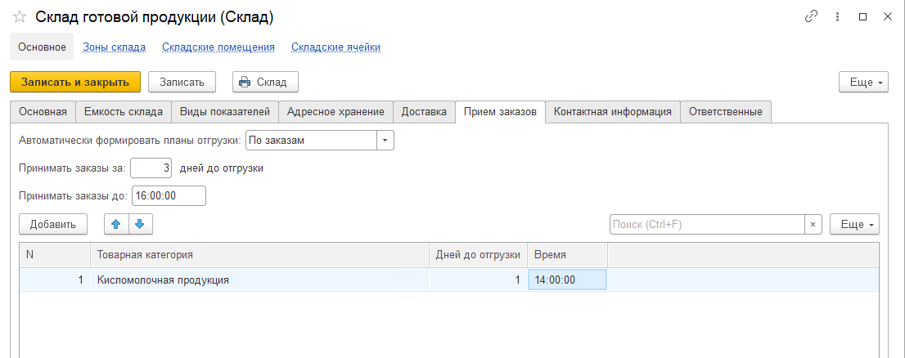
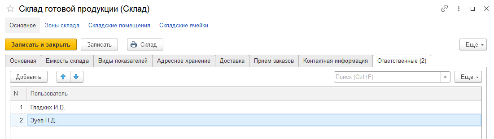

# Склад

Справочник **"Склады"** предназначен для ведения реестров складов в системе. Справочник склады расположен в подсистеме **"Нормативно-справочная информация"**.

**Вкладка "Основное"**

- Группа складов – позволяет группировать склады в группы;
- Наименование – имя склада в системе;
- Настройка контроля остатков - включает/отключает контроль остатков. Если контроль включен - не получится списать больше продукции, чем есть по учету в системе;
- Вместимость в местах - позволяет указать вместимость по контейнерам;
- Вести учет по таре - включает/отключает учет движений остатков в разрезе тары;
- Отключить учет по доп. единицам измерения - включает/отключает учет по доп. единицам измерения. В случае отключения учета документы не двигают на этом складе регистры по доп. единицам (зануляют), только по основным;

**Вкладка "Емкость склада"**

Позволяет ограничивать ескость склада под определенную товарную категорию.

**Вкладка "Виды показателей"**

Задается набор видов показателей склада и периодичность, с которой будут создаваться заявки на учет этих показателей в системе.

**Вкладка "Адресное хранение"**

Позволяет включать\отключать деление склада на ячейки (ряды, стеллажи и прочее). 

Если включено адресное хранение то необходимо указать следующую информацию:

- Указать будет ли вестись учет по упаковочным листам
- Дата  начала адресного хранения остатков
- Ячейка приемки
- Ячейка отгрузки
- Ячейка пересчета
- Зона активного отбора
- Правило размещения номенклатуры:
    - Свободные
    - Политоварные
    - Монотоварные
    - Монотоварные по серии

Для «простого склада» данная настройка не включается.

**Вкладка "Доставка"**

- Зона доставки - зона доставки, к которой относится склад
- Тип доставки - способ доставки до склада
- Длительность доставки - количество дней доставки до склада
- График доставки - дни доступные для доставки на склад
- Уточнения по доставке - уточнения графика доставки по товарным категориям

**Вкладка "Приемка заказов"**

Для автоматического контроля приемки заказов с отгрузкой с данного склада необходимо указать следующую информацию:
- Автоматическое формирование планов отгрузки
- Допустимое количество дней до отгрузки для приема заказов
- Допустимое время приема заказов
- Уточнения по товарным категориям

**Вкладка "Контактная информация"**

В поле *«Адрес»* заполняется фактический адрес склада.

**Вкладка "Ответственные"**

Физические лица ответственные за склад.

