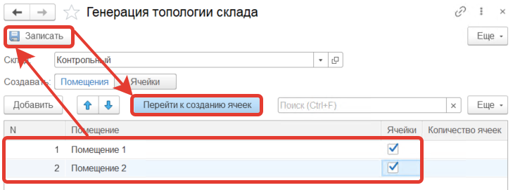
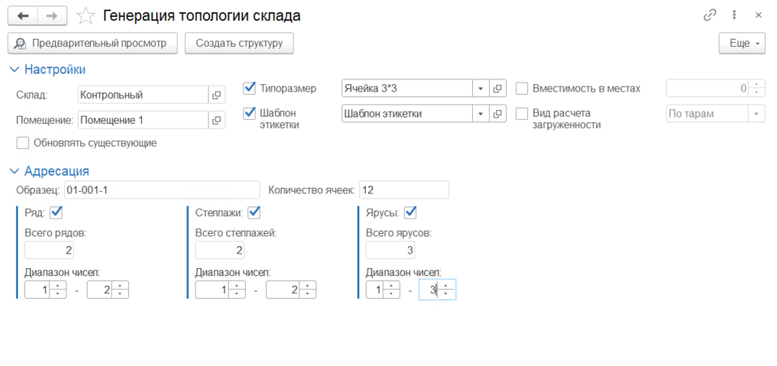
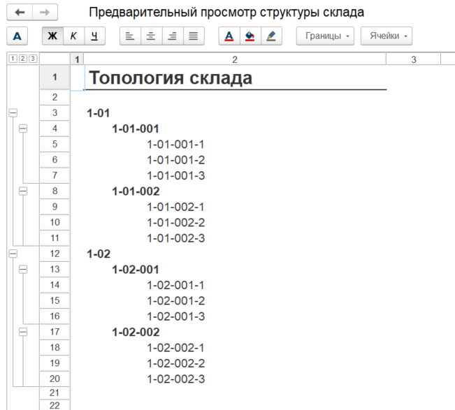
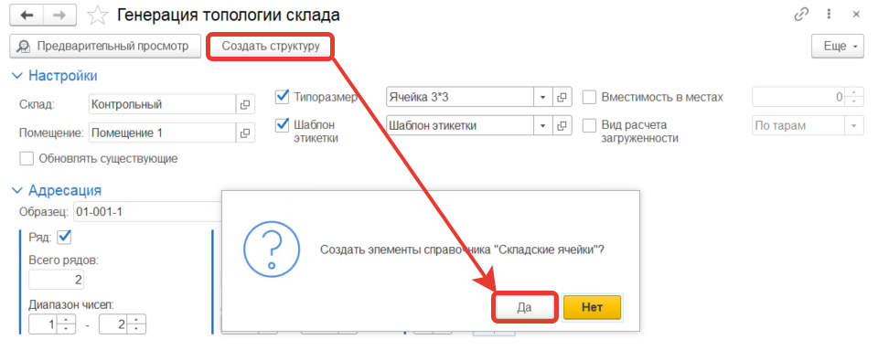
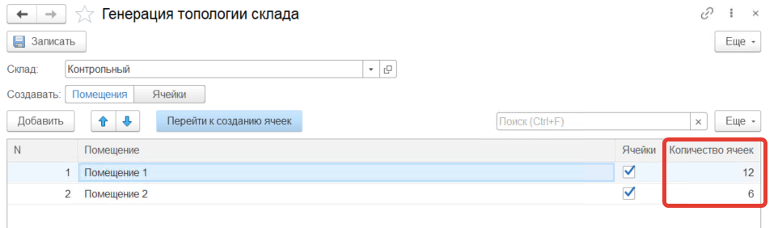
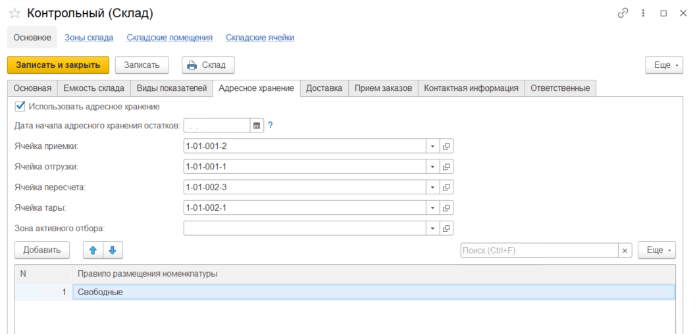

# Генерация топологии склада

Для настройки структуры склада используется обработка **"Настройка топологии склада"** расположенная в разделе **"Нормативно-справочная информация"** в подсистеме **"Склад"**.

После открытия указываем для какого склада будет создаваться топология. 

Далее выбираем или создаем новые помещения. Для создания нового помещения нажимаем кнопку **"Добавить"** и заполняем *"Наименование"* и устанавливаем признак *"Ячейки"* (если признак установлен, то для этого помещения можно будет создать структуру ячеек). После нажимаем кнопку **"Записать"**.

Для создания ячеек активируем строку с помещением для которого будем создавать структуру и нажимаем команду **"Перейти к созданию ячеек"**.

В открывшемся окне необходимо указать следующую информацию:

**Настройки:** включаются опционально

- Типоразмер
- Шаблон этикетки
- Вместимость в местах
- Вид расчета загруженности
- Обновлять существующие

**"Адресация"**: включаются опционально

- Ряды и их нумерация
- Стеллажи и их нумерация
- Ярусы и их нумерация

Система автоматически рассчитывает количество ячеек в помещении исходя из этих параметров.

Перед созданием структуры можно посмотреть получившуюся структуру, для этого необходимо нажать на кнопку **"Предварительный просмотр"**

Если получившаяся структура нас устраивает, то возвращаемся в окно **Генерация топологии склада"** и нажимаем команду **"Создать структуру"** и подтверждаем свой выбор.

Повторяем данный алгоритм для остальных помещений.

В результате мы видим, что каждое помещение имеет определенное количество ячеек:

После создании топологии склада в карточке нашего склада необходимо заполнить параметры адресного хранения:

