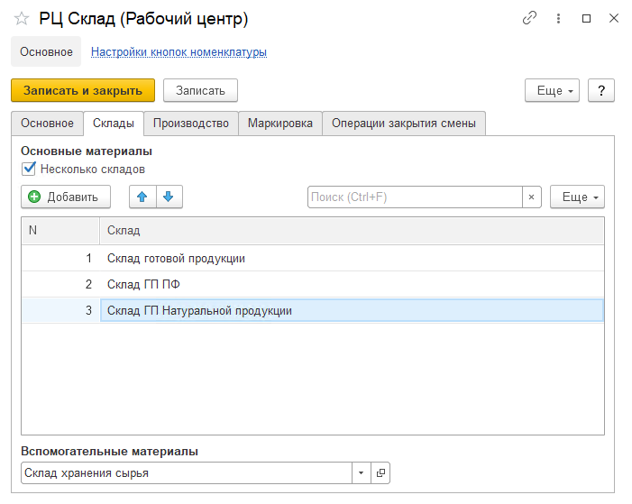
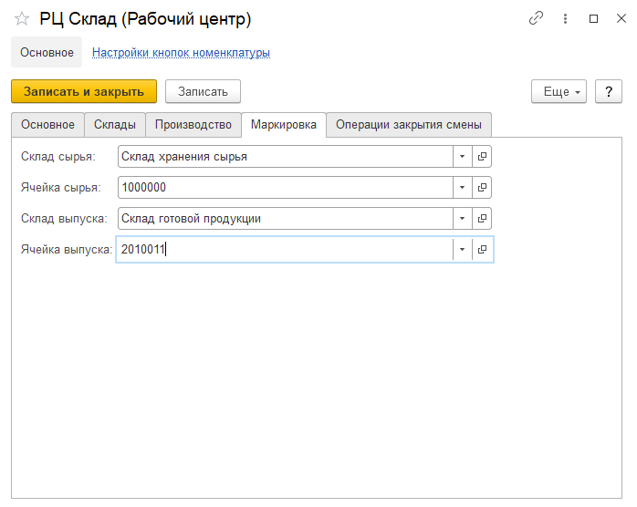

# Рабочие центры

Справочник **"Рабочие центры"** предназначен для ведения списка доступного оборудования. Справочник рабочие центры расположен в подсистеме **"Нормативно-справочная информация"**.

**Вкладка "Основное"**

- Наименование
- Вид рабочего центра
- Группа в которую входит рабочий центр - позволяет объединить рабочие центры в группы (например сгруппировать по складу)
- Подразделение - указывается Подразделение организации к которому относится данный РЦ
- График работы

**Вкладка "Склады"**

- Использование одного склада или нескольких
- Склад - на котором функционирует данный РЦ

**Вкладка "Маркировка"**

- Создание серии в момент выпуска маркировки
- Склад сырья
- Ячейка сырья - поле доступно, если на складе сырья используется адресное хранение
- Склад выпуска
- Ячейка выпуска - поле доступно, если на складе выпуска используется адресное хранение

