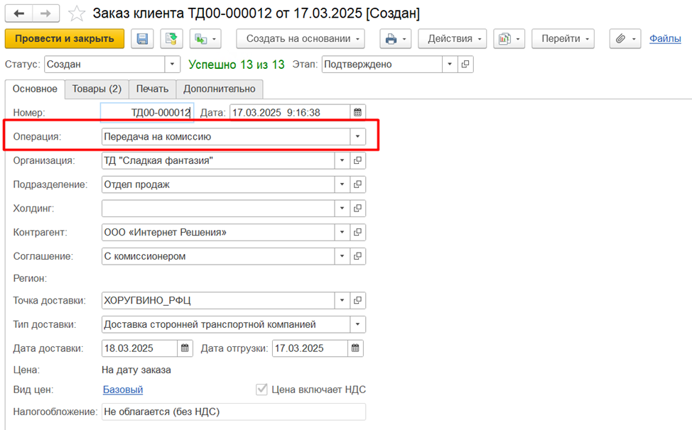

# Заказ на передачу на комиссию

Документ **"Заказ клиента с операцией Передача на комиссию"** отражает потребность комиссионера на поставку ему товаров. Документы расположены в разделе **"Заказы"**.

При создании документа автоматически подставляются статус документа и этап (если используются в системе).

На вкладке **"Основное"** указываются:

- **Номер документа** (заполняется автоматически)
- **Дата** (дата создания документа в системе)
- **Операция** - Передача на комиссию (видна, если в системе используется комиссионная торговля)  
- **Организация** (видна, если в системе несколько организаций. Заполняется автоматически, если указана основная организация)
- Подразделение (заполняется автоматически, если указано основное подразделение)
- Холдинг. Указывается, если необходимо отобрать контрагентов для выбора, иначе автоматически заполняется из карточки контрагента
- **Контрагент** (покупатель)
- **Соглашение об условиях продаж**
- Бизнес-регион (заполняется автоматически из соглашения или точки доставки)
- **Точка доставки** 
- **Тип доставки** Самовывоз, Доставка сторонней транспортной компанией, Доставка нашей транспортной компанией. Заполняется из точки доставки, можно заполнить вручную  
- **Склад отгрузки** заполняется из точки доставки, можно заполнить вручную (виден, если в системе заказ возможен только с одного склада, иначе указывается на вкладке Товары)
- Информация о ценовых условиях (момент определения цены, вид цены продажи, признак включения НДС в вид цены, налогообложение) заполняется из соглашения
- Информация о дате отгрузки и дате и времени доставки.  
Даты рассчитываются автоматически при заполнении одной из них с учетом количества дней доставки, указанного в точке доставки.   
Время доставки заполняется из точки доставки, можно заполнить вручную 

!!! attention ""  

        Вид цен в документе – вид цен передачи, налогообложение всегда Не облагается (без НДС).

 