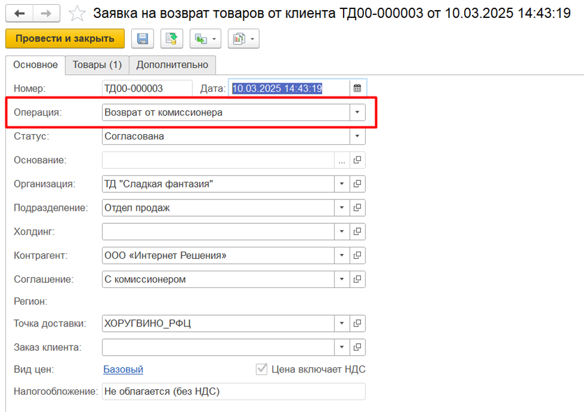

# Заявка на возврат товаров от комиссионера

Документ **"Заявка на возврат товаров от клиента" с операцией "Возврат от комиссионера"** является входящим обращением от комиссионера на возврат товаров.

[![1][1]][1]

# Создание документа

**Вкладка "Основное"**

На вкладке Основное заполняются основные данные по контрагенту.   
Если заявка заполняется по накладной, то все реквизиты заполняются автоматически и не доступны для редактирования.  
Если Основание не заполнено, то необходимо вручную заполнить обязательные поля.  

Помимо информации о контрагенте в документе указываются :  
- Операция (видно, если используется комиссионная торговля) - Возврат от комиссионера;  
- Статус (Обрабатывается, Согласована). В зависимости от статуса определяется дальнейшая возможность работы с документом;  
- Тип доставки;    
- Склад получатель (видно, если требуется доставка);  
- Информация о дате отгрузки и дате и времени доставки.   
Даты рассчитываются автоматически при заполнении одной из них с учетом количества дней доставки, указанного в складе получателе.  
Время доставки заполняется из склада получателя, можно заполнить вручную.  
Поля видно, когда требуется оформление доставки на склад.  

Вид цен – вид цен передачи, налогообложение всегда Не облагается (без НДС)

**Вкладка "Товары"**

Заполняется возвращаемыми товарами: указывается номенклатура, её характеристика, серия, количество, упаковка, цены рассчитываются автоматически на основании соглашения об условиях продаж. Если для строки не требуется доставка, то необходимо поставить признак Без возврата.

[1]: RequestForReturnOfProducts.assets/1.png