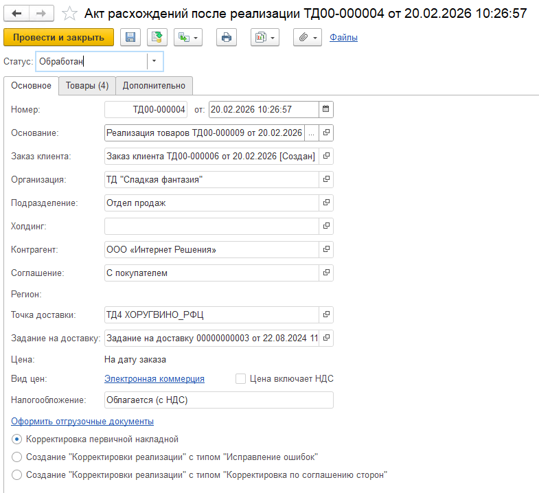
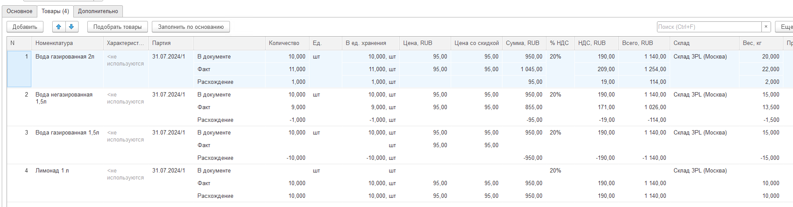

# Акт расхождений после реализации  

Акт расхождений составляется после претензии грузополучателя, в нем содержатся несоответствия между заявленными данными в реализации и фактической отгрузкой. Организация может согласиться с этим документом и на его основании создать документ корректировки или изменить первичный документ, а может отклонить.   

# Создание документа  

При создании документа указываются:   
- Статус (К обработке, Обработан, Отклонен).

**Вкладка "Основное"**

Акт расхождений заполняется по накладной. На вкладке Основное заполняются основные данные по контрагенту, все реквизиты заполняются автоматически и не доступны для редактирования.  

Также на вкладке выбирается одно из корректировочных действий:  
- Корректировка первичной накладной;    
- Корректировка по соглашению сторон;   
- Корректировка с исправлением ошибок.  

  

**Вкладка "Товары"**

Автоматически заполняется товарами из основания, доступно добавление новых строк.  

Помимо стандартных полей на вкладке Товары указываются : 
- Причина (элемент справочника Причина корректировки документа, обязательно для заполнения);     
- Комментарий.  

Кнопка **Заполнить по основанию** перезаполняет табличную часть по основанию.

  

**Вкладка "Дополнительно"**
 
- Способ создания;  
- Ответственный;  
- Номер и дата входящего документа;  
- Комментарий.  

# Оформление корректирующего действия

Для документа доступны следующие варианты оформления корректирующего действия:  
- Корректировка первичной накладной. При нажатии на кнопку Оформить отгрузочные документы изменения передаются в документ-основание.    
- Корректировка по соглашению сторон. При нажатии на кнопку Оформить отгрузочные документы создается документ Корректировка реализации товаров с видом Корректировка по соглашению сторон.    
- Корректировка с исправлением ошибок. При нажатии на кнопку Оформить отгрузочные документы создается документ Корректировка реализации товаров с видом Исправление ошибок.  

!!! attention ""  
    Оформление корректирующего действия доступно только для документа в статусе Обработан.