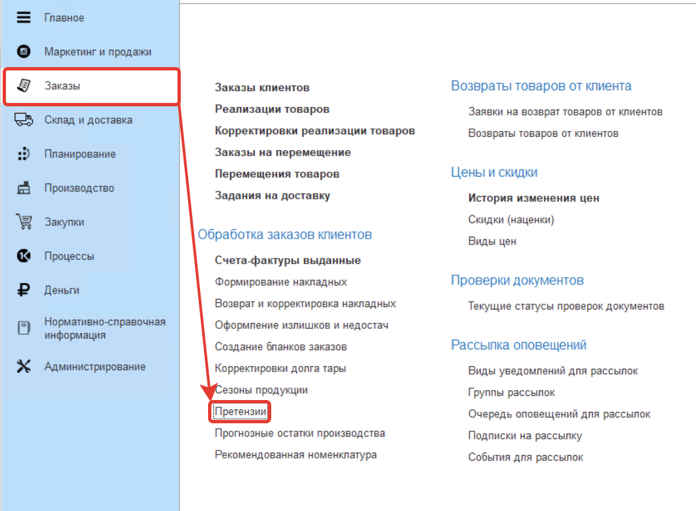
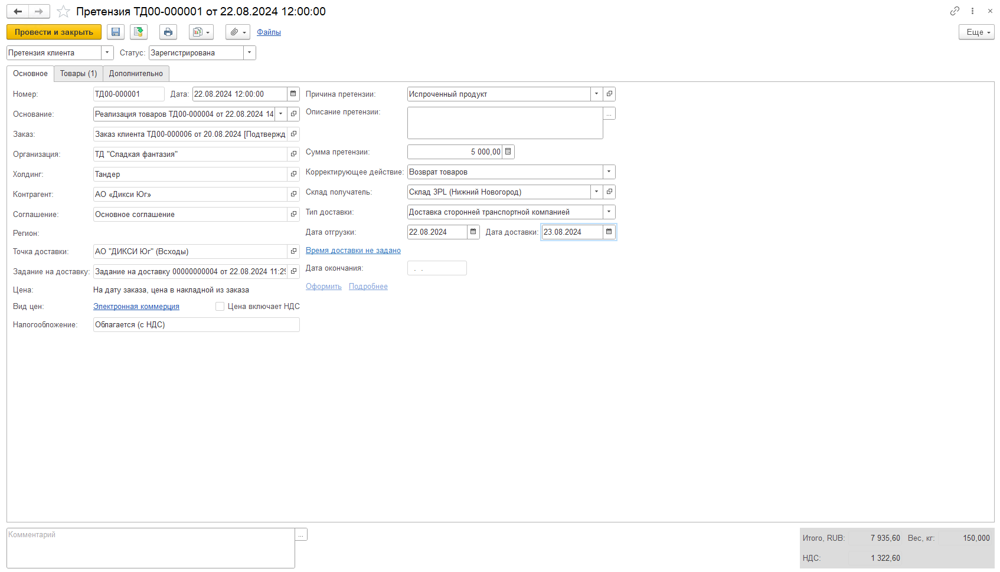
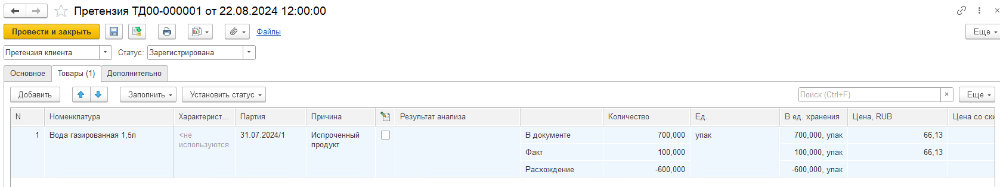

# Претензия

Документ **Претензия** фиксирует жалобу, приходящую от получателя или направляемую поставщику.  

Использование претензий в системе определяется настройкой **Использовать претензии** в настройках исполнения заказов.  

Претензии находятся в подсистеме **Заказы** - **Обработка заказов клиентов**.

При создании документа указываются:

- Тип претензии - от клиента, от комиссионера, от склада получателя, поставщику;    
- Статус (Зарегистрирована, Обрабатывается, Удовлетворена, Не удовлетворена).

**Вкладка "Основное"**

В левой части заполняются основные данные по контрагенту \ складу.  
Если претензия заполняется по накладной, то все реквизиты заполняются автоматически и не доступны для редактирования.  
Если Основание не заполнено, то необходимо вручную заполнить обязательные поля.

В правой части заполняются основные сведения по претензии:  
- Причина претензии (элемент справочника Причина корректировки документа); 
- Описание претензии;
- Сумма претензии;
- Корректирующее действие (Не требуется, Корректировка первичной накладной, Корректировка по соглашению сторон, Корректировка с исправлением ошибок, Возврат товаров);
- Склад получатель (склад, на который будет оформляться возврат товаров, видно, когда Корректирующее действие - Возврат товаров);
- Тип доставки (видно, когда Корректирующее действие - Возврат товаров);
- Информация о дате отгрузки и дате и времени доставки.  
Даты рассчитываются автоматически при заполнении одной из них с учетом количества дней доставки, указанного в складе получателе.  
Время доставки заполняется из склада получателя, можно заполнить вручную.  
Поля видно, когда требуется оформление доставки на склад;  
- Дата окончания - дата записи в статусе "Удовлетворена" или "Не удовлетворена".  
- Кнопка Оформить для оформления корректирующего действия;
- Гиперссылка Подробнее открывает окно, в котором видны сформированные корректирующие документы. 

**Вкладка "Товары"**

Автоматически заполняется товарами из основания, не обязательна для заполнения.  

Помимо стандартных полей на вкладке Товары указываются : 
- Номенклатура, характеристика, партия;
- Причина (элемент справочника Причина корректировки документа, обязательно для заполнения); 
- Флаг Требуются анализы
- Результат анализа (строка или документ Анализы номенклатуры), обязательно для заполнения в статусах Удовлетворена / Не удовлетворена (если стоит флаг);
- Флаг Требуется доставка;  
- Статус согласования (На согласовании, Согласовано, Не согласовано);    
- Комментарий.

**Вкладка "Дополнительно"**

- Подразделение;  
- Способ создания;  
- Ответственный;  
- Номер и дата входящего документа.  