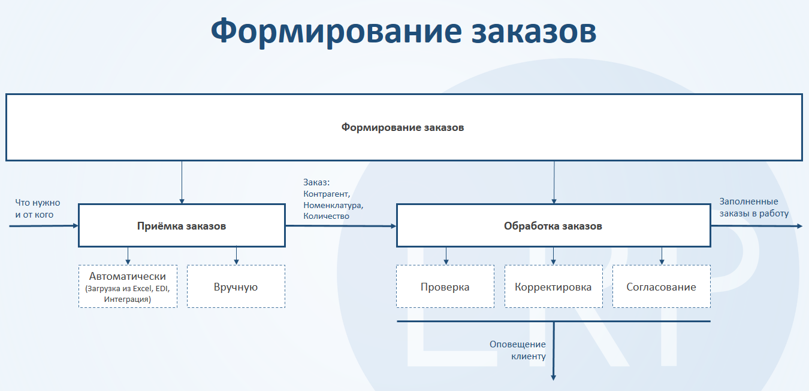

# Формирование заказов

Документ заказа отражает потребность на поставку товаров. 

# Настройки приемки заказов 

В разделе **Заказы** в подсистеме **"Сервис"** - **"Настройки исполнения заказов"** можно включить дополнительные настройки создания заказов.

**"Контроль остатков заказов"** не позволяет после оформления по заказу плана отгрузки сделать количество товаров в заказе клиента меньше чем в плане. При этом количество в плане отгрузки нельзя сделать больше чем в заказе.  

[![24][24]][24]

**"Заказывать с нескольких складов"** разрешает создавать в системе заказы с отгрузкой с нескольких складов. В таком случае склад отгрузки указывается на вкладке Товары для каждой строки номенклатуры.

# Ручная приемка заказов

В системе предусмотрена ручная приемка следующих заказов:  
- [Заказ клиента](../CustomerOrders/CustomerOrder.md);  
- Заказ комиссионера;    
- Заказ на перемещение;  
- Внутренний заказ.  

# Загрузка заказов из бланка Excel  

В системе предусмотрена загрузка заказов из бланка Excel для следующих заказов:  
- [Заказ клиента](../CustomerOrders/CustomerOrder.md);  
- Заказ комиссионера;  
- Заказ на перемещение.

Для выгрузки бланков создаются **"Настройки выгрузки заказов"**, которые расположены в разделе **Заказы** в подсистеме **"Сервис"** - **"Настройки исполнения заказов"**.

[![8][8]][8]

[![9][9]][9]

Для **"Настроек выгрузки заказов"** заполняются:

- Наименование;  
- Признак отправки бланков на почту.

В табличной части заполняются:

- Точки доставки;  
- Каталоги, в которые выгружаются бланки;  
- Электронная почта, если бланки после выгрузки отправляются на почту (автоматически заполняется из карточки контрагента).  

[![10][10]][10]

Бланки для заказов создаются в АРМе **"Создание бланков заказов"**, который расположен в разделе **"Заказы"**.

[![11][11]][11]

На вкладке **"Заказы клиентов"** по кнопке **"Подобрать настройки"** выбираются настройки выгрузки заказов.  
По настройкам заполняются точка доставки, соглашение с контрагентом, каталог, куда будет выгружен бланк, признак отправки на почту и почтовый адрес. Так же эти данные могут быть заполнены вручную.  
!!! attention ""  
    На данной вкладке заполняется информация для создания бланков заказов клиента и заказов комиссионера.

[![13][13]][13]

На вкладке **"Заказы на перемещение"** формируются бланки для заказов на перемещение товаров. Заполняются склад отправитель, склад получатель, каталог, куда будет выгружен бланк, признак отправки на почту и почтовый адрес.  

На вкладке **"Настройки"** заполняются дата (планируемая дата доставки заказа), организация, подразделение. Признак **защищать бланки** позволяет защитить от редактирования все колонки таблицы товаров выгружаемого бланка кроме количества и даты доставки.

**Настройки каталога товаров** включают в себя условия на товары, которые будут указаны в бланке:

- Только с ценой. В бланке будут указаны только те товары, на которые установлена цена на дату доставки по виду цены из соглашения с контрагентом.      
- Доступные по сезонам. В бланке будут указаны товары, для которых не установлен сезон или для которых дата доставки попадает в сезон.     
- Только из спецификации. В бланке будут указаны товары, которые указаны в регистре "Спецификации соглашений с клиентами" для соглашения с контрагентом.    
- Доступные для продажи. В бланке окажется номенклатура, для которой дата доставки попадает в диапазон между датами ввода в продажу и вывода из продажи.

[![12][12]][12]

Нажимаем кнопку **"Сформировать бланки"**, в указанном каталоге появится бланк с названием, в котором указаны соглашение и дата отгрузки.

[![14][14]][14]

В таблице товаров указывается количество заказываемых товаров.

[![15][15]][15]

При загрузке бланка указывается каталог, из которого будет загружен бланк и каталог, в который этот бланк будет перемещен после загрузки.

[![16][16]][16]

При загрузке создается заказ клиента.  
Характеристика номенклатуры заполняется автоматически только для контрагентов, для которых указаны характеристики контрагентов.

При загрузке бланка с той же датой отгрузки, точкой доставки и соглашением повторно данные в старом заказе будут изменены на загружаемые.

Заказы могут быть загружены регламентным заданием **"Загрузка заказов из бланков"**

[![19][19]][19]

Для этого нужно заполнить **"Настройки загрузки заказов"**, которые расположены в разделе **Заказы** в подсистеме **"Сервис"** - **"Настройки исполнения заказов"**

[![8][8]][8]

[![20][20]][20]

Для **"Настроек загрузки заказов"** заполняются:

- Наименование;  
- Признак автоматической загрузки (данная настройка будет использоваться регламентным заданием);  
- Признак создания одного заказа на дату. Если признак включен, то при загрузке бланка с той же датой отгрузки, точкой доставки и соглашением повторно данные в старом заказе будут изменены на загружаемые. Если признак выключен, то будут формироваться новые заказы;    
- Путь к папке загрузки;  
- Путь к папке обработанных бланков;  

[![21][21]][21]

**"Настройки загрузки заказов"** указываются для контрагента:

[![22][22]][22]

При запуске регламентного задания **"Загрузка заказов из бланков"** в систему загружаются заказы клиентов согласно настройкам.

[1]: CustomerOrder.assets/1.png
[2]: CustomerOrder.assets/MainPage.png
[3]: CustomerOrder.assets/Goods.png
[4]: CustomerOrder.assets/printing.png
[5]: CustomerOrder.assets/extra.png
[6]: CustomerOrder.assets/6.png
[7]: CustomerOrder.assets/7.png
[8]: CustomerOrder.assets/8.png
[9]: CustomerOrder.assets/9.png
[10]: CustomerOrder.assets/10.png
[11]: CustomerOrder.assets/11.png
[12]: CustomerOrder.assets/12.png
[13]: CustomerOrder.assets/13.png
[14]: CustomerOrder.assets/14.png
[15]: CustomerOrder.assets/15.png
[16]: CustomerOrder.assets/16.png
[17]: CustomerOrder.assets/17.png
[18]: CustomerOrder.assets/18.png
[19]: CustomerOrder.assets/19.png
[20]: CustomerOrder.assets/20.png
[21]: CustomerOrder.assets/21.png
[22]: CustomerOrder.assets/22.png
[23]: CustomerOrder.assets/23.png
[24]: CustomerOrder.assets/24.png
[25]: CustomerOrder.assets/25.png