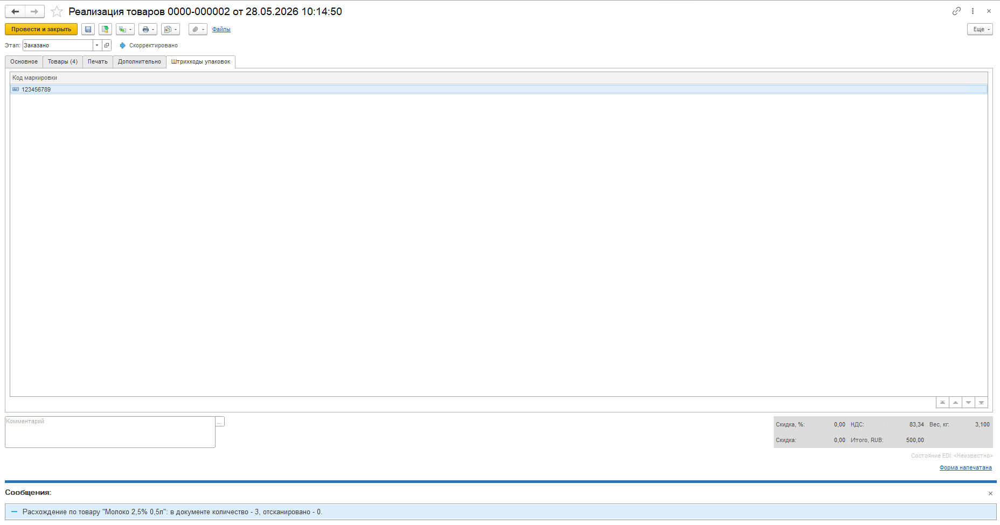

# Честный знак

При работе с ЭДО может потребоваться передавать коды маркировок. Для этого случая была добавлена настройка "Вести учет маркируемой продукции "Честный знак", которая находится в подсистеме Заказы в настройках исполнения заказов.  

При включении настройки :  
- В карточке номенклатуры на вкладке "Дополнительно" появляется признак "Честный знак".  
- На формах документов накладных появляется вкладка "Штрихкоды упаковок", которую можно заполнить вручную или с помощью сканера.  

!!! attention ""  

    При проведении накладной в таком случае будет происходить проверка соответствия количества кодов и количества товаров с признаком "Честный знак" в табличных частях.

