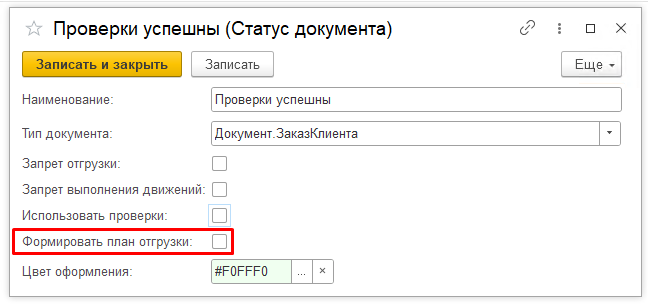
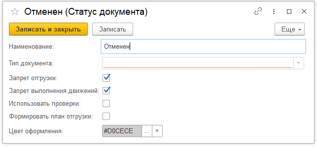
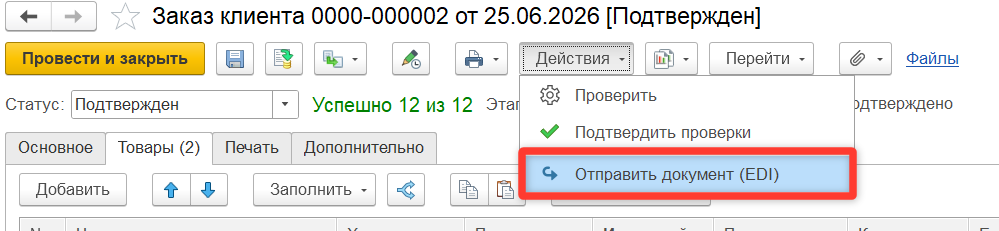

# Особенности сценариев

**Загрузка новых версий заказа**  

Автоматическая загрузка новой версии заказа клиента возможна только в статусе, в котором невозможно формировать планы отгрузки. Если заказ в статусе формирования планов, тогда потребуется ручная обработка заказа.

**Отмена заказа клиента**  

Для того, чтобы отправить покупателю информацию об отмененном заказе, необходимо поставить его в предопределенный Отменен. В таком случае ORDRSP сформируется с обнуленными позициями, даже если в заказе количество заполнено.

**Переотправка сообщений**  

В системе предусмотрены два сценария переотправки сообщений ORDRSP и DESADV : регламентный и ручной. Правило задаются в [настройках](../../Settings/CounterpartiesSettings.md).  

Для регламентной отправки необходимо изменить один из ключевых реквизитов: дата (доставки для заказа клиента, документа для реализации), подтвержденное количество, номенклатура, цена, упаковочный лист. Переотправка произойдет с запуском Контур EDI: Обмен с сервером.  

Для ручной отправки необходимо в документе нажать на кнопку Отправить документ (EDI). После этого откроется типовая форма отправки сообщения из модуля Контур.EDI.

**Отправка информации о SSCC-кодах**  

При наличии настройки «Отправлять данные об упаковках (SSCC) вместе с DESADV и INVOIC» в Контур.EDI в сообщении уведомления об отгрузке должны быть указаны SSCC коды.   
Для этого в на вкладке Товары реализации должны быть указаны упаковочные листы, данные по упаковкам будут браться оттуда.  