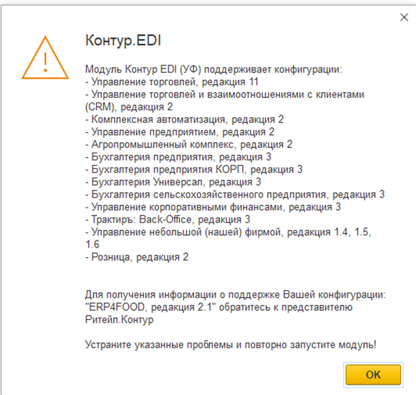
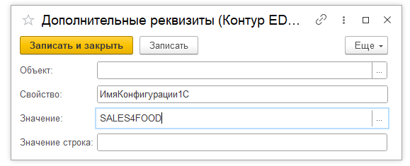
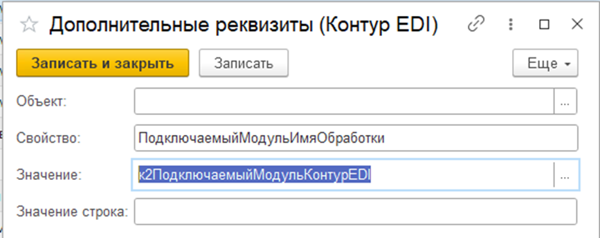
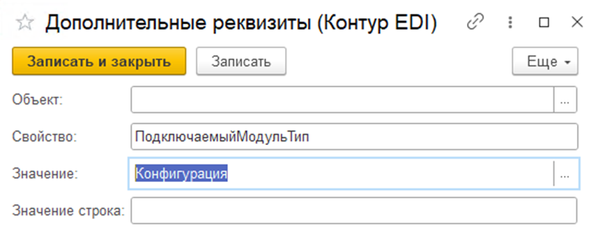
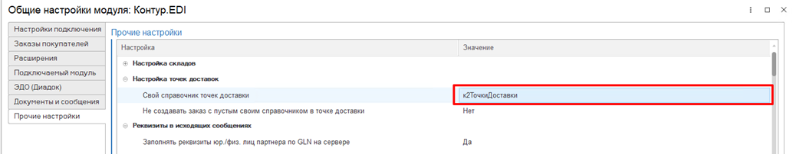

# Подключение ПМ

1.	Ставим расширение Контур.EDI (предоставляет оператор). Расширение само по себе не включает обработку, она предоставляется отдельно.
2.	В базе появляется подсистема Контур.EDI.
3.	Заходим в подсистему. Нужно нажать на «Открыть модуль Контур.EDI».
4. Необходимо выбрать расположение модуля Контур.EDI (обработка). Обработка обычно поставляется оператором отдельно и периодически может обновляться в отличие от основного расширения. В зависимости от решения, где будет располагаться обработка в проекте, нужно выбрать расположение в открывшемся окне.
5.	Далее при открытии модуля будет показано следующее сообщение:

Так как конфигурация SALES4FOOD не поддерживается в стандартном модуле, нужно произвести подключение вручную с помощью нескольких настроек. Для этого нужно зайти в Дополнительные реквизиты (Контур EDI) (Регистры сведений) и выбить следующие настройки:

•	Свойство: ИмяКонфигурации1С  
•	Значение: SALES4FOOD (Строка)

•	Свойство: ПодключаемыйМодульИмяОбработки  
•	Значение: к2ПодключаемыйМодульКонтурEDI (Строка)

•	Свойство: ПодключаемыйМодульТип  
•	Значение: Конфигурация (Строка)

6.	Признаком успешного открытия модуля будет после этого открытие стартового помощника.
7.  В общих настройках модуля на вкладке Прочие настройки указываем Свой справочник точек доставки.  

  