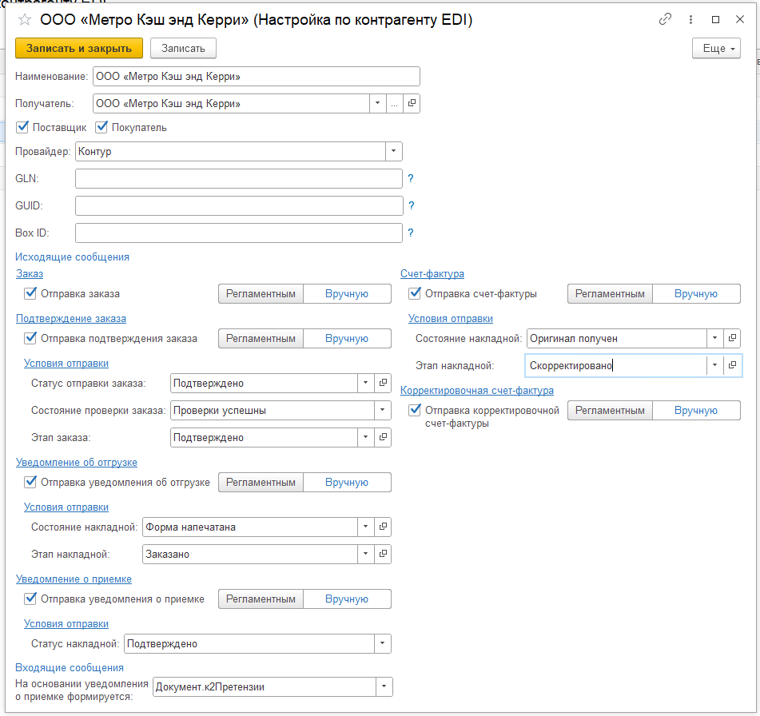

# Настройки по контрагенту  

Справочник Настройки по контрагенту предназначен для хранения информации по контрагенту для всех провайдеров ЭДО, использующихся в системе.   
Справочник находится в подсистеме Заказы в Настройках исполнения заказов.  

В справочнике указываются :  
- Наименование;  
- Получатель (контрагент, точка доставки);  
- Признаки Поставщик и Покупатель (видно для получателя-контрагента);  
- Провайдер;  
- Настройки исходящих сообщений;
- Настройки входящих сообщений.  

Для провайдера Контур указываются GLN (для EDI), GUID и Box ID (для Диадок).   

В настройках исходящих сообщений указываются настройки :  
- Отправка заказа. Включается, если с контрагентом идет обмен ORDERS. Доступна ручная отправка и с помощью регламентного задания Контур EDI: Обмен с сервером.  
- Отправка подтверждения заказа. Включается, если с контрагентом идет обмен ORDRSP. Доступна ручная отправка и с помощью регламентного задания Контур EDI: Обмен с сервером.  
Также можно указать условия отправки ORDRSP : статус отправки заказа, состояние проверки заказа, этап заказа.  
- Уведомление об отгрузке. Включается, если с контрагентом идет обмен DESADV. Доступна ручная отправка и с помощью регламентного задания Контур EDI: Обмен с сервером.  
Также можно указать условия отправки DESADV : состояние накладной, этап накладной.   
- Уведомление об приемке. Включается, если с контрагентом идет обмен RECADV. Доступна ручная отправка и с помощью регламентного задания Контур EDI: Обмен с сервером.  
Также можно указать условие отправки RECADV : состояние накладной (поступления).   
- Счет-фактура. Включается, если с контрагентом идет обмен INVOIC или счетами-фактурами. Доступна ручная отправка и с помощью регламентного задания Контур EDI: Обмен с сервером или Контур ЭДО: Отправка счетов-фактур.  
Также можно указать условие отправки INVOIC : состояние накладной, этап накладной.  
- Корректировочная счет-фактура. Включается, если с контрагентом идет обмен INVOIC, COINVOIC, счетами-фактурами, корректировочными счетами-фактурами. Доступна ручная отправка и с помощью регламентного задания Контур EDI: Обмен с сервером или Контур ЭДО: Отправка счетов-фактур.  
  
В настройках входящих сообщений указываются настройки :  
- Какой документ формируется при наличии расхождения между DESADV и RECADV (претензии, акт расхождений после реализации).

*Сохраненные в справочнике данные перенесутся в настройки подключаемого модуля.*

