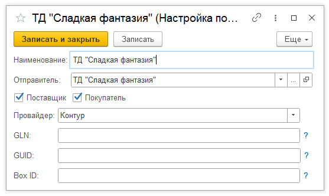

# Настройки по организации

Справочник Настройки по организации предназначен для хранения информации по организации для всех провайдеров ЭДО, использующихся в системе.   
Справочник находится в подсистеме Заказы в Настройках исполнения заказов.  

В справочнике указываются :  
- Наименование;  
- Отправитель (организация, склад);  
- Признаки Поставщик и Покупатель (видно для отправителя-организации); 
- Провайдер.  

Для провайдера Контур указываются GLN (для EDI), GUID и Box ID (для Диадок).   
*Сохраненные в справочнике данные перенесутся в настройки подключаемого модуля.*

