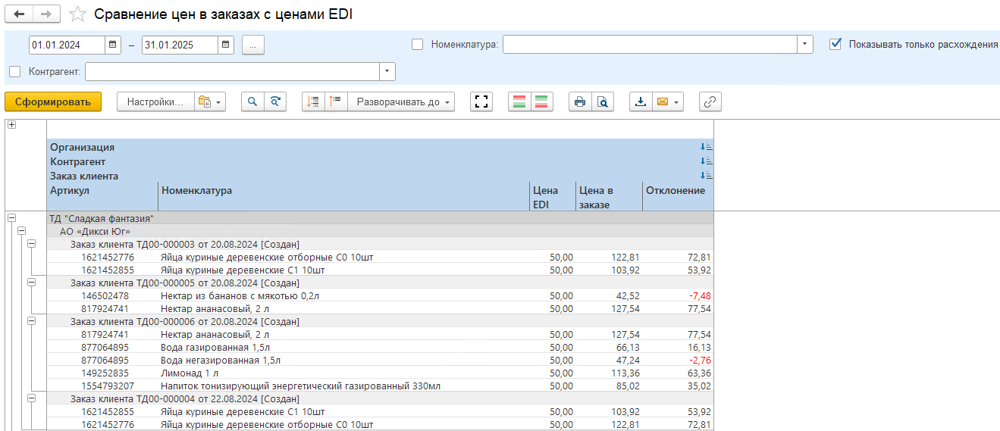

# Сравнение цен в заказах с ценой из EDI

Для мониторинга отклонений цен в заказе от цен, которые поступили от сетей в сообщении EDI используется отчет "Сравнение цен в заказах с ценами EDI".      
В отчете можно сделать отбор только по заказам с расхождениями в ценах.  

