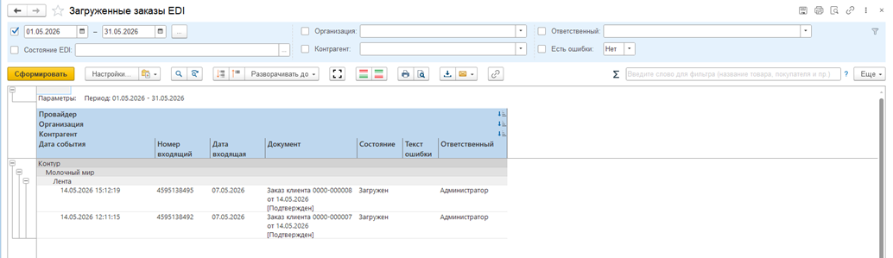

# Загруженные заказы EDI

Отчет Загруженные заказы EDI позволяет увидеть все загруженные заказы в систему. Если есть необходимости увидеть только ошибочные заказы, есть отбор «Есть ошибки», чтобы посмотреть заказы, которые не создались или не провелись.

