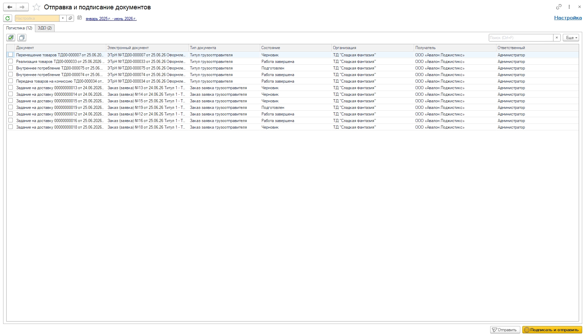

# АРМ Отправка и подписание документов

Для подписания и отправки электронных документов в системе предусмотрен АРМ Отправка и подписание документов, в который можно перейти по кнопке из следующих АРМов :  
- [Рабочее место менеджера по доставке](../../../CustomerService/PlanningOfShipments/DistributionOfShipmentsByCar.md);  
- [Формирование накладных](../../../CustomerService/FormationOfShipments/FormationOfTheAccompanyingDocuments/FormationOfTheImplementationsOfProducts.md);  
- [Возврат и корректировка накладных](../../../CustomerService/FormationOfAFeedback/AdjustingProductImplementations/AdjustingProductImplementations.md).  

*Вкладка АРМа ЭДО доступна при активной настройке Включен EDI, вкладка АРМа Логистика доступна при активной настройке Использовать транспортный документооборот.*

Отбор по документам в АРМе происходит по "Настройкам подписания". Автоматически подставляется настройка из константы "Настройка подписания по умолчанию".

В "Настройках подписания" заполняются :

- Наименование;
- Начало периода - элемент справочника "Варианты начала периода", заполняется для определения начала периода отбора документов;
- Конец периода - элемент справочника "Варианты начала периода", заполняется для определения конца периода отбора документов; 
- Организации - отбор документов по выбранным организациям;  
- Получатели - отбор документов по выбранным получателям;  
- Состояния документов ЭДО - отбор документов ЭДО по выбранным состояниям;  
- Типы сообщения ЭДО - отбор документов ЭДО по выбранным типам сообщений;  
- Состояния документов ЭПД - отбор документов ЭПД по выбранным состояниям;  
- Типы сообщения ЭПД - отбор документов ЭПД по выбранным типам сообщений;  
- Описание;  
- Автор.

Для отправки / отправки и подписания документов переходим к АРМу "Отправка и подписание документов".

Затем нажимаем кнопку "Обновить", на вкладке "Логистика" будут выведены электронные перевозочные документы, на вкладке "ЭДО" - электронные документы в соответствии с отборами.

По кнопке "Отправить" документы будут отправлены без подписания, по кнопке "Подписать и отправить" документы будут подписаны через сертификат системы и отправлены.