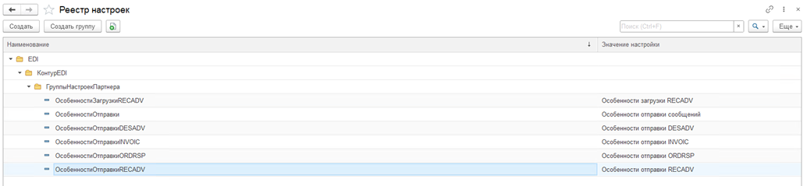

# Реестр настроек

Справочник Реестр настроек содержит чисто технические настройки.  
При необходимости можно изменить как саму группу, куда будет добавлено условие, так и идентификатор, и представление настройки. 

*Дерево настроек партнера в Контуре может просто не собраться или собраться без добавленных кастомных настроек, если они будут добавлены некорректно.*

