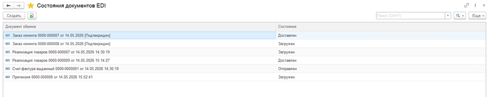
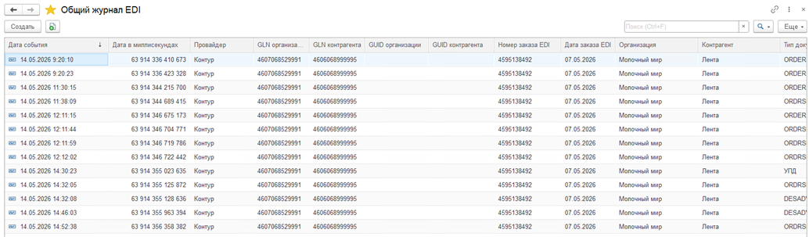

# Общий журнал EDI

Были добавлены «Состояния документов EDI» (Регистры сведений). В этом регистре отображается документ и текущее по нему состояние. Состояния делятся на два типа: EDI и ЭДО. Состояния выведены в списки соответствующих документов.

Запись в регистр состояний обычно идет сразу за записью в Общий журнал EDI (Регистры сведений). Это регистр, в котором регистрируется каждое событие с уникальным идентификатором. Например, в случае с Контур.EDI это происходит при обработке события записи сообщения Контур.EDI, а в случае с Диадоком – при актуализации списка, когда через API мы получаем новый статус. Данные этого регистра используются для отчетов.  

