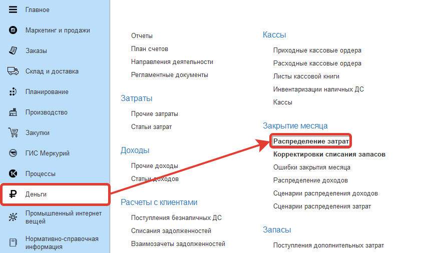
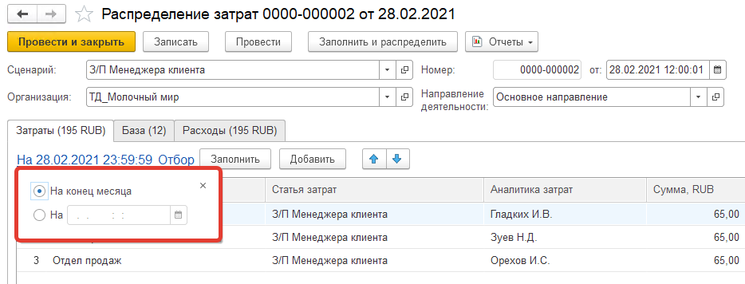
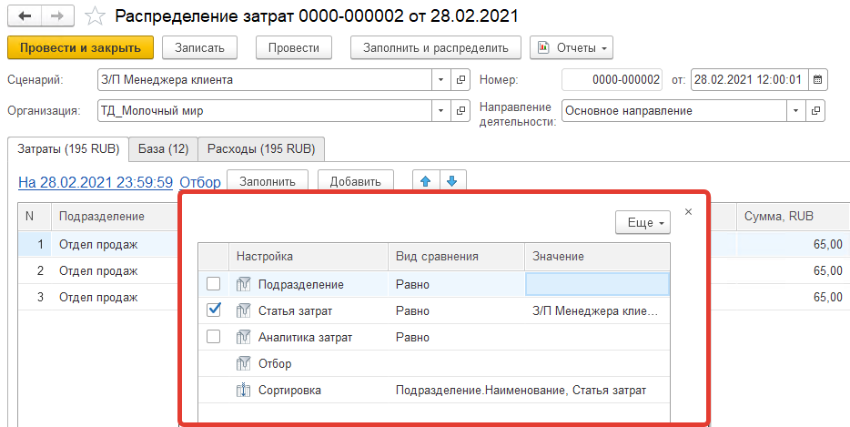
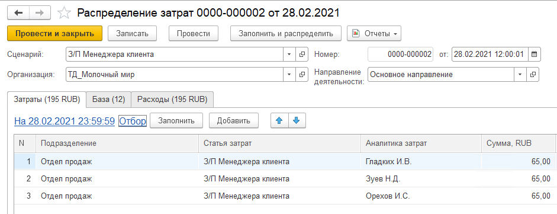
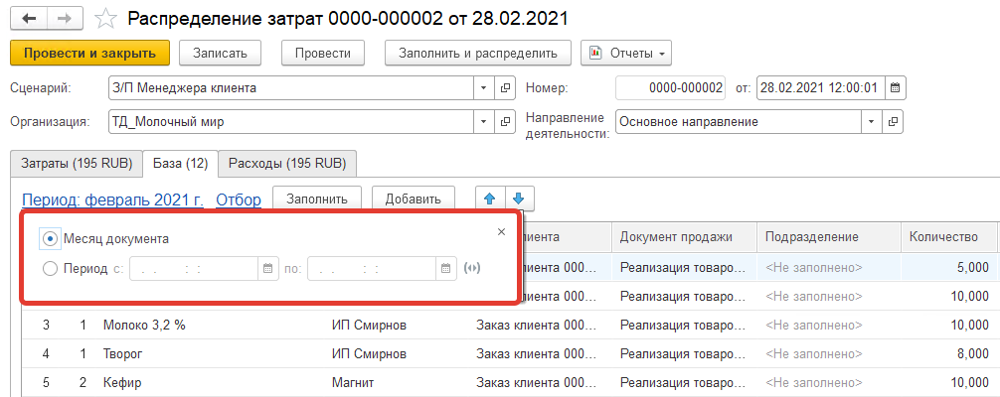
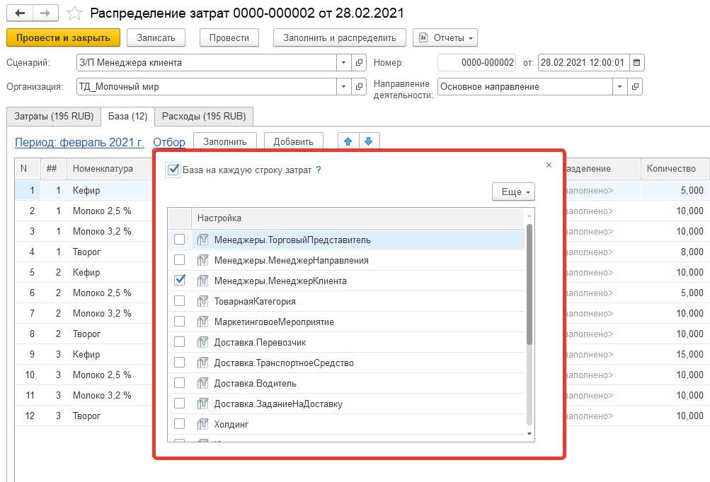
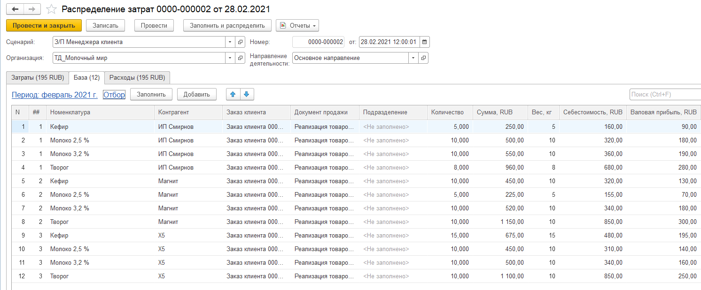
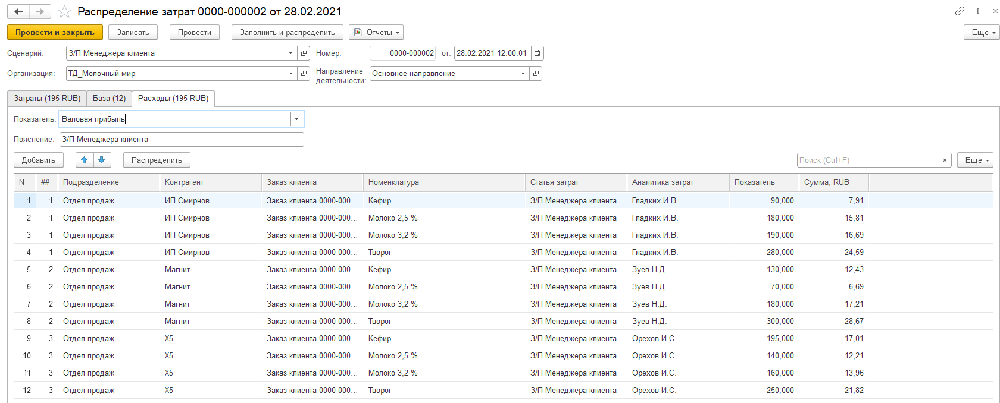

# Распределение затрат

Документы **"Распределение затрат"** предназначены для распределения затрат по аналитикам отгруженной продукции. Распределение используется для формирования финансового результата.

Документы **"Распределение затрат"** расположены в разделе **"Деньги"** в подсистеме **"Закрытие месяца"**:

 

В документе можно указать [сценарий](CostAllocationScenario.md), остальные поля документа будут заполнены по нему автоматически. Кнопка **"Заполнить и распределить"** позволяет выполнить заполнение таблиц **"Затраты"**, **"База"** и распределить затраты в соответсвии с выбранным сценарием одним действием.

Если сценария нет, то заполняются поля:

- Организация
- [Направление деятельности](DirectionOfActivity.md)

На вкладке **"Затраты"** заполняются отборы:

- По дате: либо устанавливается признак **"На конец месяца"**, тогда затраты будут заполняться на конец месяца, либо заполняется поле **"На"** - элемент справочника **Варианты начала периода**, который отвечает за дату на которую расчитываются затраты

 

- Подразделение - отвечает за то по каким подразделениям будут выбираться затраты
- [Статья затрат](ItemsOfExpenditure.md) - отвечает за отбор затрат по указанным статьям
- Аналитика затрат - отвечает за отбор затрат по указанным аналитикам
- Отбор - позволяет установить дополнительные отборы
- Сортировка - позволяет задать порядок затрат

 

Далее по кнопке **"Заполнить"** табличная часть заполняется затратами согласно установленным отборам, заполняются поля:

- Подразделение
- [Статья затрат](ItemsOfExpenditure.md)
- Аналитика затрат
- Сумма

 

На вкладке **"База"** заполняются отборы:

- По дате: либо устанавливается признак **Месяц документа**, тогда база определяется за весь месяц в который создано распределение затрат, либо устанавливается период расчета базы

 

- Признак **"База на каждую строку затрат"** - устанавливается для того, чтобы для каждой строки затрат определялась своя база
- В таблице устанавливаются отборы по которым определяется база (например, если распределяются затраты на доставку нам сторонней транспортной компанией, то базу нужно расчитывать по Перевозчику):

    - Торговый представитель - менеджер точки доставки
    - Менеджер направления - менеджер группы партнеров для планирования
    - Менеджер клиента - менеджер контрагента
    - Товарная категория
    - Маркетинговое мероприятие
    - Перевозчик
    - Транспортное средство
    - Водитель
    - Задание на доставку
    - Холдинг
    - Контрагент
    - Заказ клиента
    - Подразделение
    - Отбор - позволяет установить дополнительные отборы
    - Сортировка - позволяет задать порядок базы

 

По кнопке **"Заполнить"** табличная часть вкладки заполняется отгрузками по установленным отборам согласно аналитикам затрат, заполняются поля:

- Номенклатура
- Контрагент
- Заказ клиента
- Документ продаж
- Подразделение
- Количество
- Сумма
- Вес
- Себестоимость
- Валовая прибыль

 

На вкладке **"Расходы"** заполняются:

- Показатель:

    - Количество - затраты будут распределяться пропорционально количеству отгружаемого товара
    - Сумма - затраты будут распределяться пропорционально сумме за отгружаемый товар
    - Вес - затраты будут распределяться пропорционально весам отгружаемого товара
    - Себестоимость - затраты будут распределяться пропорционально себестоимости отгружаемого товара
    - Валовая прибыль - затраты будут распределяться пропорционально валовой прибыли от отгружаемого товара

- Пояснение - произвольный комментарий

По кнопке **"Распределить"** на вкладке табличная часть заполняется распределенными по базе затратами, заполняются поля:

- Подразделение
- Контрагент
- Заказ клиента
- Номенклатура
- [Статья затрат](ItemsOfExpenditure.md)
- Аналитика затрат
- Показатель
- Сумма

 