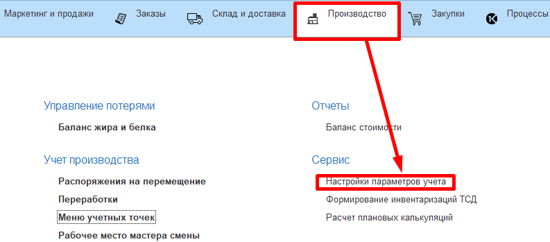

**Настройки учета в системе**
=============================

Перед стартом работы в MES-системе следует определить некоторые её
настройки, которые будут влиять на дальнейшее прохождение учета всего
производства.

 

 

Эти настройки находятся в панели "Настройка параметров учета":

 

-   *Основной график работы предприятия* - указывается, по какому графику работает предприятие. Есть встроенный - общепринятый график работы на территории РФ.
-   *Контролировать остатки по производственным заданиям* -
    включает/отключает контроль остатков по производственным заданиям. Нельзя выполнить сверхнормы по заданию (выпустить больше, чем указано), нельзя недовыполнить.
-   *Вести учет по сменам* - включает/отключает учет производства в несколько смен.  
    Например, две смены - с 00:00 до 08:00 и с 08:00 до
    24:00. Если отключен, то по умолчанию ведется учет по суточной смене: с 00:00 до 23:59.
-   *Вести учет остатков на таре и местоположения тары* - включает/отключает учет по тарам/контейнерам и т.п.
-   *Отключить использование стандартной формы ресурсных спецификаций* - включает/отключает возможность выбора вида отображения формы ресурсных спецификаций.
-   *Формировать итоговые документы за смену* - включает/отключает формирование и видимость документа "Акт переработки" - сборный документ по всем выпускам и расходам за смену на рабочем центре с учетом жира и белка в продукции и сырье.
-   *Блокировать сырье на карантине* - включает/отключает блокировку партии сырья на карантин.
-   *Производство мясное* - включает/отключает возможность работать с объектами, относящимися к учету на мясном производстве.
-   *Производство молочное* - включает/отключает возможность работать с объектами, относящимися к учету на молочном/сырном производстве.
-   *Принимать жидкое сырье в литрах* - включает/отключает возможность принятия молочного сырья в литрах. На основании введенного показателя плотности, принятое количество пересчитывается в килограммы автоматически.
-   *Формат времени нормы хранения* - ведет учет по норме хранения продукции на разных участках производства в часах, минутах или сутках.
-   *Склад пересчета* - склад, на который отправляются тары в случае инвентаризации, когда данные системы не сходятся с введенными пользователем данными о наличии тары на том или ином складе.
-   *Показатель плотности* - элемент справочника "Показатели номенклатуры", фактические значения которого используется в пересчете указанного объема в килограммы там, где это настроено.
-   *Единица измерения веса* - основная единица измерения веса.
-   *Префикс штрихкодов узла РИБ* - используется в случае распределенной базы для определения узла.

**Параметры учета баланса жира и белка**

-   *Номенклатура потерь* - "условная" номенклатура, без серий и
    характеристик, которая будет соответствовать потерям при сведении баланса по жиру и белку на разных участках производства.
-   *Нормативы потерь в балансе жира и белка* - в разрезе рабочих центров задаются нормативы потерь по кг, жкг и бкг в процентах.

 

**Единицы измерения**

-   *Белкокилограммы* - единица измерения бкг (обычно создается, а не подбирается из классификатора).
-   *Жирокилограммы* - единица измерения жкг (обычно создается, а не подбирается из классификатора).

 

**Показатели анализов**

-   *М.д. белка* - показатель (элемент справочника "Показатели анализов номенклатуры), отвечающий за массовую долю белка в любой продукции.

-   *М.д. жира* - показатель (элемент справочника "Показатели анализов номенклатуры), отвечающий за массовую долю жира в любой продукции.

 

**Коэффициенты в расчете стоимости**

-   *Белок* - задает коэфициент стоимости белка.

-   *Жир* - задает коэфициент стоимости жира.
-   *Базисный белок, %* - нормативное значение белка в молочном сырье.
-   *Базисный жир, %* - нормативное значение жира в молочном сырье.

 

**Себестоимость**

-   *Использовать расчет сырьевой себестоимости* - включает/отключает возможность расчета сырьевой себестоимости.
-   *Макс. глубина разузлования* - максимальный шаг разузлования сырья, который используется при выпуске конкретной партии продукта.
-   *Мин. коэффициент разузлования* - минимальное значение коэффициента разузлования. Если материал входит в себестоимость партии с коэффициентом, меньшим указанного, он не разузловывается и исключается из рассчета.
-   *Вид цен себестоимость* - цена, которая будет соответствовать
    себестоимости продукции. Этим видом производится установка плановой себестоимости и расчитывается фактическая.
