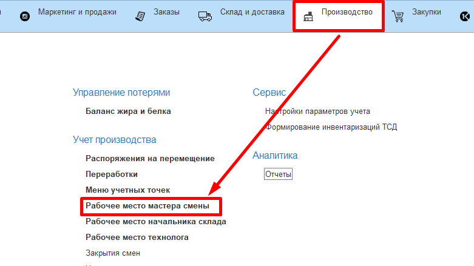
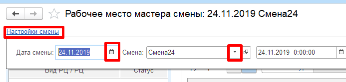
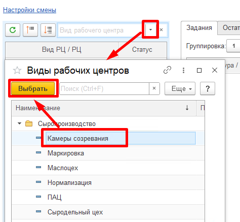
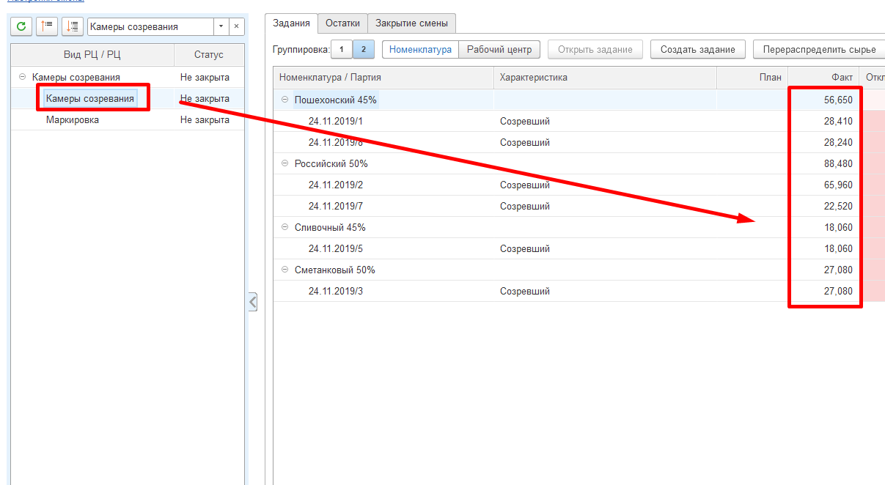
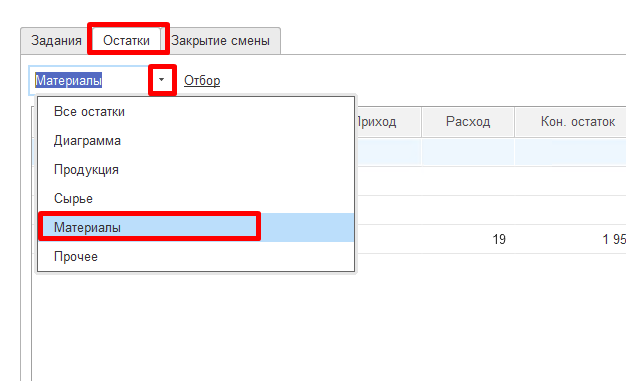
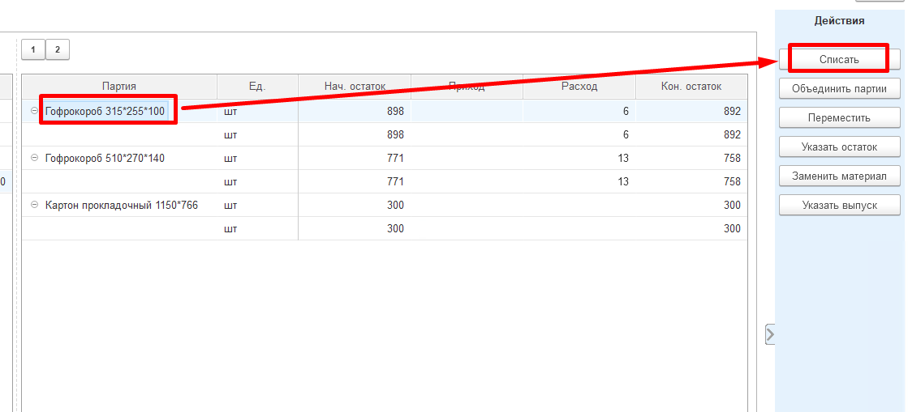
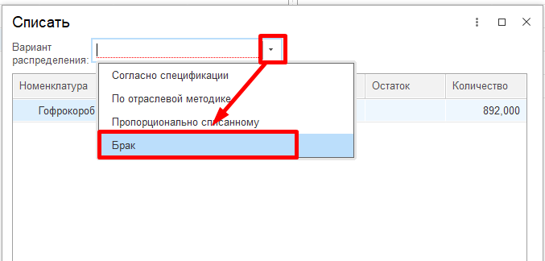
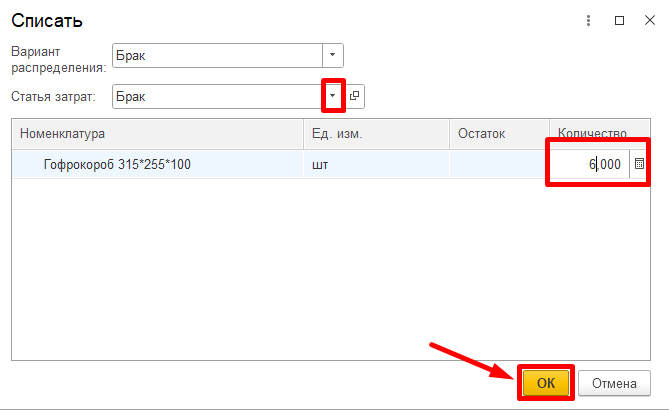
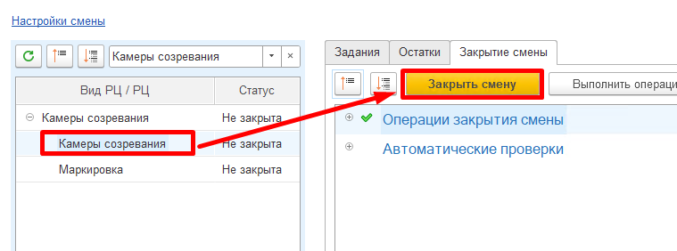

# Закрытие смен

Контроль всех введенных в систему данных за рабочую смену осуществляется
мастером смены через "Рабочее место мастера смены"

 

 

-   Открыть "Рабочее место мастера смены":  
    
    
-   Указать смену для контроля и участок, на котором зреет сыр:  
      
    

-   В таблице ниже выбрать участок, на котором зреет сыр и который
    необходимо проверить на корректность. Справа заполнится различная
    информация по данному участку. Например, на вкладке "Выпуск"
    отображается вся информация по снятому с созреванию сыру за
    указанную смену:  
    

-   На вкладке "Остатки" -\> "Материалы" отображается информация по
    расходу материалов, использованных в процессе снятия сыра с
    созревания, за указанную смену:  
    

-   Здесь же можно списать отбракованные за смену короба. Для этого
    выбрать в таблице нужный короб (и его партию), нажать "Списать":  
    

-   Указать, что списывается брак:  
    

-   Указать статью списания для брака, количество и подтвердить
    действие:  
    

-   После выполнения всех вышеперечисленных действий и проверки
    корректности всех данных, смену необходимо закрыть для невозможности
    внесения в нее изменений. Для этого выбрать участок в таблице слева
    и нажать "Закрыть":  
    

-   При возникновении ошибок (отрицательных остатков) система выдаст
    предупреждения. Необходимо исправить ошибки и еще раз повторить предыдущее действие.
    

