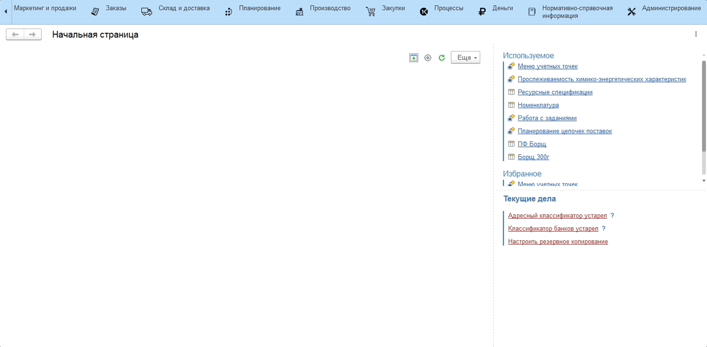
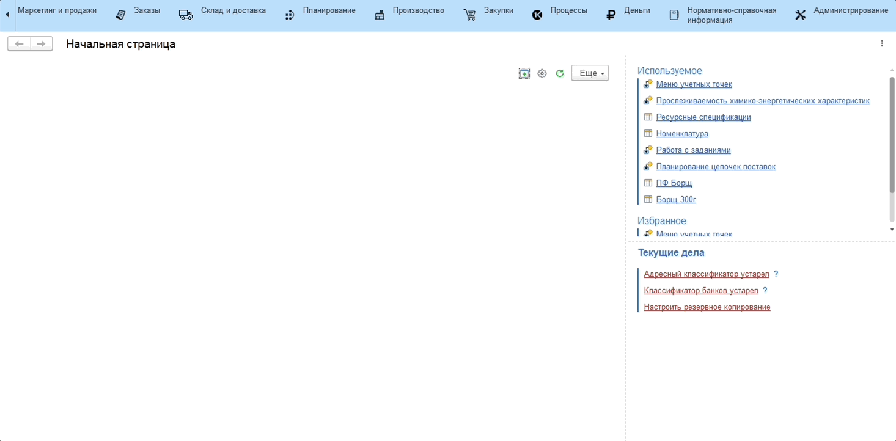

# Настройка кнопок учетных точек

Оперативный учет перемещений между цехами производства предполагается вести на сенсорном киоске/планшете. Для фиксации операций используется рабочее место **"Меню учетных точек"** с настроенными **Учетными точками** и **Кнопками учетных точек**.

Для включения возможности подтверждения факта перемещения между цехами (участками) производства необходимо:

1. Настроить кнопку учетной точки на складе-отправителя с параметром **"Контролировать перемещение"**;

    

2. На складе-получателе настроить кнопку учетной точки с обработкой **"Работа с перемещениями"**.

    
