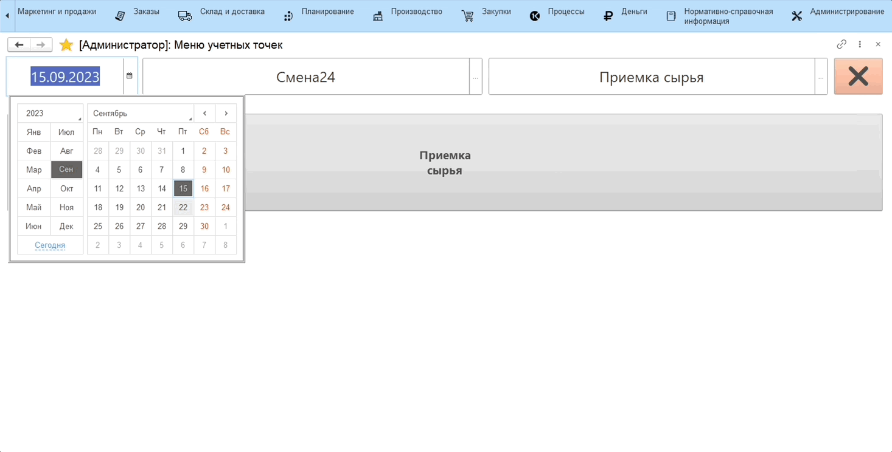
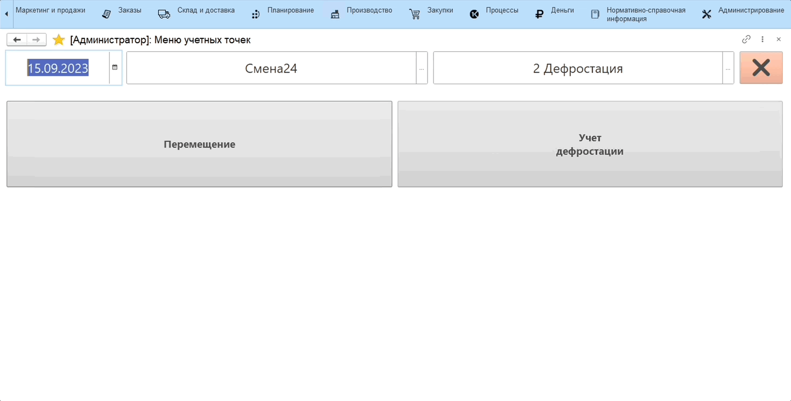

# Контроль перемещений между цехами

Функционал контроля перемещений заключается в заполнении плана перемещения складом-отправителем и факсацией факта получения складом-получателем.

Первым этап необходимо выполнить настройку [кнопок учетных точек](CommonInformation.md).

Сценарий для оперативного подтверждения перемещений следующий:

### **На стороне склада-отправителя:**

Учет перемещения предполагается осуществлять через сенсорный киоск/планшет.

1. В подсистеме **"Производство"** открываем **"Меню учетных точек"**;
2. Указываем дату смены, смену и учетную точку, на которой производится учет. Нажимаем на кнопку **"Перемещение"**;
3. Находим партию продукта, который необходимо переместить, нажимаем кнопку **"Выбрать"**;
4. Открывается окно для заполнения данных о перемещаемой позиции:
    - Слева указана номенклатура изделия, которое предполагается взвесить;
    - Справа автоматически указываются склад-отправитель и склад-получатель, при необходимости склад-получатель можно изменить вручную;
    - С помощью калькулятора тары указываем тип и количество тары, в которой производится взвешивание;
    - Получаем вес брутто с весов, вес нетто рассчитается автоматически;
    - По окончании взвешивания нажимаем на кнопку **"Подтвердить"**.
5. В системе сформировался документ **"Распоряжение на перемещение"** с заполненной вкладкой **План**, в статусе **Выполняется**.

### **На стороне склада-получателя:**

Учет факта перемещения предполагается осуществлять через сенсорный киоск/планшет.

1. В подсистеме **"Производство"** открываем **"Меню учетных точек"**;
2. Указываем дату смены, смену и учетную точку, на которой производится учет. Нажимаем на кнопку **"Подтверждение перемещений"**;
3. Выбираем позицию номенклатуры, которую принимаем, нажимаем кнопку **"Выбрать"**;
4. Открывается окно для заполнения данных о принимаемой позиции:
    - Слева указана номенклатура изделия, которое предполагается взвесить;
    - Получаем вес брутто с весов, вес нетто рассчитается автоматически;
    - По окончании взвешивания нажимаем на кнопку **"Подтвердить"**.
5. Документ **"Распоряжение на перемещение"** поменял статус на **Выполнено**, заполнилась вкладка **Факт**.

