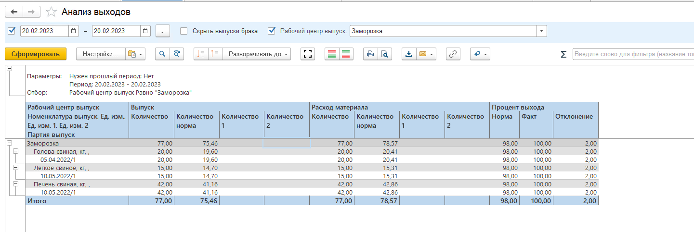

# Анализ выходов

Для контроля показателей на разных участках производства в системе предусмотрен отчет «Анализ выходов».

Для формирования отчета необходимо указать период, рабочий центр и нажать кнопку «Сформировать».

Таблица отчета содержит следующие данные:

- Рабочий центр выпуск – наименование участка на котором производился выпуск;
- Номенклатура выпуск – наименование выпуска;
- Партия выпуска – сведения о партии выпущенного продукта;
- Выпуск - количественные показатели выпущенной продукции по нормативу и по фактическим данным;
- Расход материала – фактические и нормативные количественные показатели сырья, использованного в производстве;
- Процент выхода - показатели выхода продукции в процентах. В отчете отражен нормативный процент выхода и фактический процент выхода, что позволяет проанализировать качество каждой конкретной партии.

