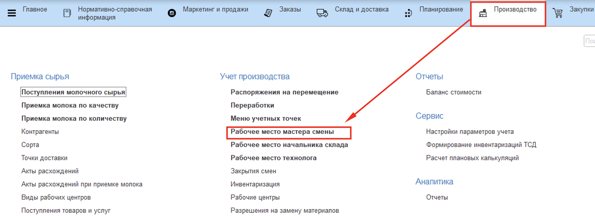
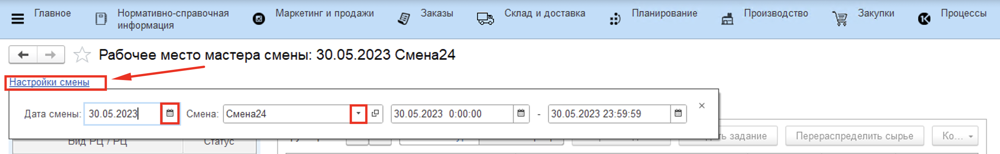
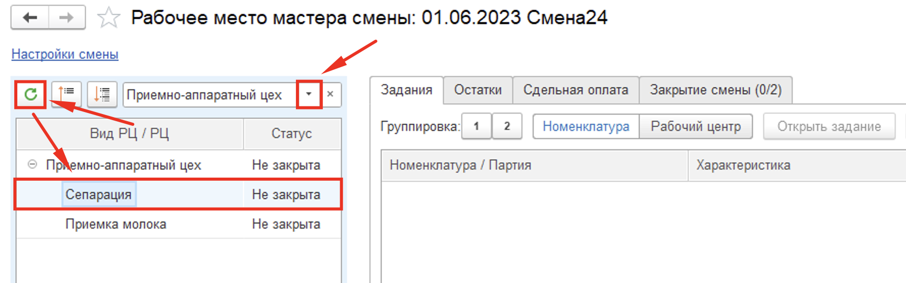
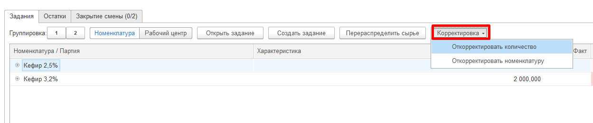
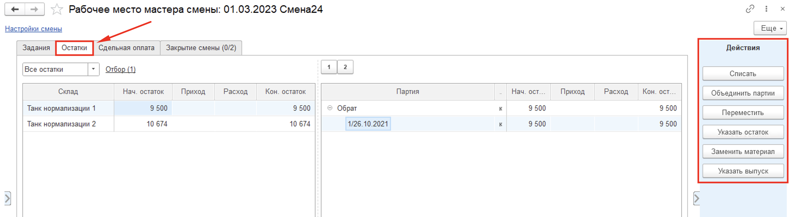
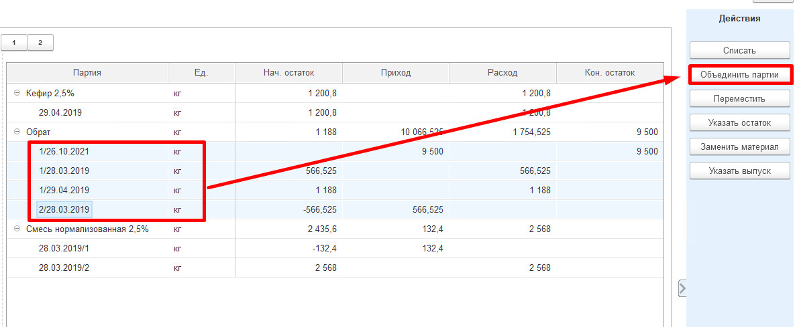
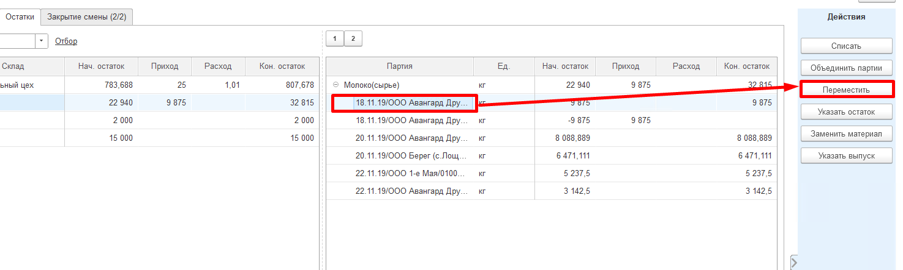
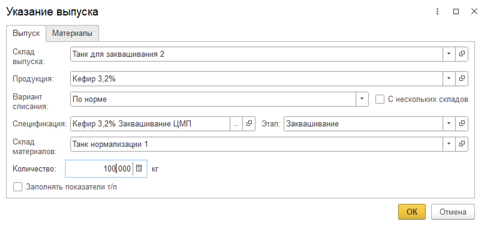

**Действия в Рабочем месте мастера смены**
==========================================

Как правило, мастер смены на производстве вовлечен во все процессы цеха, поэтому для удобства организации его работы различные производственные операции были объединены в одно рабочее место.

**"Рабочее место мастера смены"** находится в подсистеме **"Производство"**:

Перед началом работы необходимо настроить смену. Перейдя по гиперссылке **"Настройки смены"**, нужно указать текущую дату и выбрать смену.

Затем нужно выбрать рабочий участок, на котором необходимо подвести итоги смены. После нажатия на кнопку "Обновить" в табличной части ниже появится информация о рабочем участке и рабочих центрах, закрепленных за ним.

# Задания

## Создать задание

На вкладке **"Задания"** фиксируется информация по всем совершенным на рабочем центре выпускам.

Чтобы создать задание на смену, нужно нажать на кнопку **"Создать задание"** в шапке вкладки. Откроется стандартная форма документа **"Производственное задание"**.

После того, как производственное задание было создано, в табличной части на вкладке **"Задания"** появится информация о плановом выпуске.

Когда задание будет выполнено, появится информация о фактическом выпуске и об отклонении факта от плана.

## Открыть задание

Открывает ранее созданный документ "Производственное задание" на указанную смену на выбранный рабочий центр.

## Корректировка

Если причиной отклонения факта от плана является ввод ошибочных данных сотрудником цеха, созданные документы можно скорректировать.

Для этого нужно:

- Выбрать партию;
- Нажать на кнопку **"Корректировка"**;
- Выбрать один из пункт выпадающего списка:
    - Откорректировать количество - позволяет внести правки в количество выпуска по выбранной партии в таблице "Выпуск";
    - Откорректировать номенклатуру - позволяет изменить вид продукции у выбранной в таблице "Выпуск" партии.

    

- В открывшемся окне ввести скорректированное значение;
- Нажать на кнопку **"ОК"**.

Откроется окно корректировки документов. Следует ознакомиться со списком и содержанием документов и отметить флагом те, которые необходимо изменить. По завершении проверки нужно нажать на кнопку **"ОК"**.

## Перераспределить сырье

Функция **"Перераспределить сырье"** позволяет распределить потраченные материалы между основными и побочными выпусками.

Когда за смену выпускается основная и побочная продукция (например, сливки и обрат), материал списывается в полном объеме на основной выпуск, а на побочный не распределяется. Чтобы отразить расход сырья на побочный выпуск, нужно нажать на кнопку "Перераспределить сырье". Сформируется документ "Распределение материалов", в котором часть материалов спишется с расхода на основной выпуск и ляжет на побочный.

Распределение требует учтенных в системе показателей жира и белка по каждой партии выпуска и каждой партии материалов.

# Остатки

На вкладке **"Остатки"** отображаются текущие остатки материалов на складах рабочего центра и обороты сырья за смену. На панели **"Действия"** доступны следующие операции управления остатками:

## Списать

Если за текущую смену на производстве выпускалась продукция и тратился материал, но в системе этот расход не отражен, и материал все еще числится на складе, следует списать его на сделанные выпуски. 
Для этого нужно:

- Встать на строку сырья;
- Нажать на кнопку "Списать";
- В открывшейся форме выбрать вариант списания, указать или количество сырья (если списать нужно не всё), или его остаток и нажать "ОК".

В таблице ниже автоматически скорректируется количество прихода и расхода по выбранной номенклатуре.

Формируется документ "Распределение материалов".

### Варианты списания сырья:

- **Согласно спецификации** - списание выбранных материалов происходит на все существующие выпуски за смену, для которых этот материал обозначен в спецификации.  

    ??? info "Пример"
        За смену были упакованы розливы "Молоко 1,5%" (100кг) и "Молоко 2,5%" (200кг). В спецификациях на эти выпуски в материалах указана "Бутылка 1л". Если списать бутылки **Согласно спецификации** (600шт), то материал ляжет на выпуски и "Молоко 1,5%", и "Молоко 2,5%" в объемах, пропорциональных объемам выпусков (200шт и 400шт).

- **Пропорционально списанному** - списание выбранных материалов происходит только на те выпуски, на которые этот материал уже был потрачен.

    ??? info "Пример"
        Если выбранный материал был потрачен на выпуск как *вспомогательный*, то по распределению **Пропорционально списанному**, он будет *досписан* на существующие выпуски. Например, "Бутылки 1л" были потрачены при упаковке на "Молоко 1,5%" (5шт) и на "Молоко 2,5%" (15шт). Если списать по выбранной методике еще 100 бутылок, то 25шт спишутся на "Молоко 1,5%" и 75шт на "Молоко "2,5%".
    
    - Этой опцией так же можно воспользоваться для списания **усушки**. Если на выпуск продукции уже было сделано распределение сырья, то дополнительное списание *основного* материала по варианту **Пропорционально списанному** отнесет списание на статью затрат Усушка.

- **По отраслевой методике** - списание выбранных материалов происходит на все существующие выпуски за смену, для которых этот материал обозначен в спецификации. В отличие от списания **Согласно спецификации**, материал списывается на выпуски, пропорционально содержанию жира и белка в них.

    ??? info "Пример" 
        Может применяться на переделе, где были сделаны выпуски сливок и обрата. Например, молоко имеет 3,5% жира, сливки имеют 20% жира, обрат - 0,5% жира. Были выпущены 200кг сливок и 800кг обрата, списано 1265кг молока. В сливках содержится 40кг жира, в обрате - 4кг. Следовательно для получения 40кг жира нужно потратить 1150кг молока жирностью 3,5%, а для 4кг обрата - 115кг молока.

- **Брак** - предполагает списание материалов (только вида "Короб" и "Пакет") на брак. Требует уже учтенного расхода материала. Выбранный материал списывается по статье затрат Брак на уже имеющиеся выпуски пропорционально потраченному.

    ??? info "Пример" 
        "Гофрокороба" были потрачены при упаковке на "Молоко 1,5%" (5шт) и на "Молоко "2,5%" (15шт). Если списать на брак 4 короба, то 1шт будет списана на "Молоко "1,5%" и 3шт на "Молоко "2,5%".

## Объединить партии

Данная операция применяется для выпуска производственной партии сырья. Например, если в один танк сливается поступившее молоко от разных поставщиков, то партии в танке можно объединить в одну и провести лабораторные анализы для созданной партии.

1. Выбрать партии или склад, нажать **"Объединить партии"**,
    подтвердить количество выпуска (автоматически - сумма всех выделенных
    партий).

      

2. Создается документ **"Переработка"**, где в выпуске - молоко с созданной
    партией, а в материалах - все партии, которые были выделены (или все
    серии в танке, если позиционирование было на складе).

3. Если настроен вид анализа для вида номенклатуры, также создастся документ **"Заявка на анализы"**, 
   по которому необходимо заполнить **"Анализы номенклатуры"** для объединенной партии.

## Переместить

Данная функция позволяет отразить перемещение партий продукции и материалов между складами.  

1. Выбрать в таблице партию (партии), нажать **"Переместить"**. Указать
    склад-получатель и количество перемещаемого сырья.

    

2. Создается документ **"Распоряжение на перемещение"**.

## Указать остаток

Если в течение смены в системе отражают выпуски, но не фиксируют расход сырья, то в конце дня можно указать фактический остаток сырья на складе, а остальное списать на выпуски. Указание остатка необходимо выполнять на том же рабочем центре, на котором указывались выпуски.

После того, как в системе уже отражены все выпуски за смену, нужно:

- Выбрать склад;
- Нажать **"Указать остаток"**;
- Указать фактический объем и анализы оставшегося сырья на складе (в танке);
- Списать использованное за день сырье по действию **Списать** - **по отраслевой методике** - таким образом оно распределится на произведенные выпуски и на указанный остаток пропорционально содержанию жира и белка в них.

## Заменить материал

С помощью данной операции можно провести замену материала для существующего выпуска. Указанное количество уже использованного (заменяемого) материала приходуется обратно на склад, а материал-замена расходуется на ту продукцию, на которую тратился заменяемый.

Для этого необходимо:

- Выбрать заменяемый материал, нажать **"Заменить материал"**;
- Указать, чем заменяется (серию), количество для замены;
- Формируется документ "Распределение материалов".

## Указать выпуск

Данная функция может использоваться как для оперативного учета, так и для учета в конце смены. Предполагает отражение фактических выпусков основной продукции, побочных выпусков и возвратных отходов.

??? info "Примечание"
    **Возвратный отход** - это побочная продукция, для которой установлена фиксированная цена. Материал на возвратный отход не распределяется (вариант распределения - **"Не распределять"**).

Для этого необходимо:

- Выбрать в таблице склад выпуска, нажать **"Указать выпуск"**. Указать, что и в каком количестве выпускается;
- Указать спецификацию, по которой производится продукция;
- Указать вариант распределения;
- Указать склады, с которых расходуются материалы (кроме варианта распределения - **"Не распределять"**);
- Создается документ **"Переработка"** на выпуск указанной продукции. Количество выпуска и данные о материалах заполняются по указанному правилу.

### Варианты распределения:

- **По норме** - списание материалов на данный выпуск будет выполнено в количествах с расчетом на норматив.

    ??? info "Пример"
        Заведена спецификация на выпуск сливок (норматив - м.д.ж. 20%, м.д.б. 3%) и обрата (0,05%, 3%). Молоко сырье имеет показатели 3,4% жира и 3% белка. Распределение **по норме** пересчитает, какое количество молока указанной жирности нужно потратить, чтобы получить нормативный выход сливок и обрата.

- **Целиком по спецификации** - будут списаны все остатки материалов, которые по спецификации подходят для производства выпуска.
- **Не распределять** - списание материалов на данный выпуск выполнено не будет. Распределение материалов на выпуск можно будет выполнить позже по кнопке **"Списать"**.
