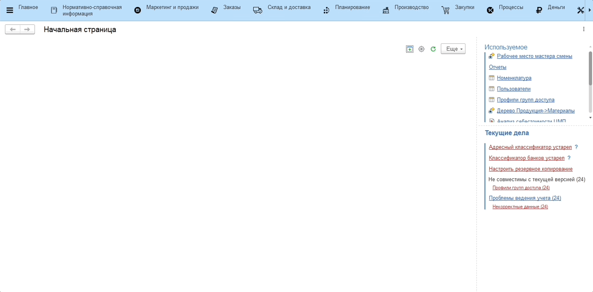

# Учет фактического количества принимаемого молока

После приемки молока по качеству оператор приемки фиксирует фактическое количество принимаемого молока.

Учет фактического количества принимаемого молока происходит через рабочее место **"Приемка молока по количеству"**.

1. Откроем рабочее место **"Приемка молока по количеству"**;
2. Заполним параметры, которые включают:
    - Организацию;
    - Участок приемки молока.
3. Выберем из списка документ "Поступление молочного сырья", соответвующий машине (ориентироваться можно по времени, номеру и водителю), с которой будет сливаться молоко;

    Автоматически заполняются заявленные веса по секциям.

4. По каждой секции укажем фактическое количество, сколько в какой танк было закачано молока;
5. Нажмем **"Записать"**.

