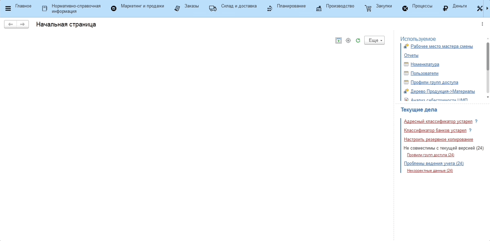
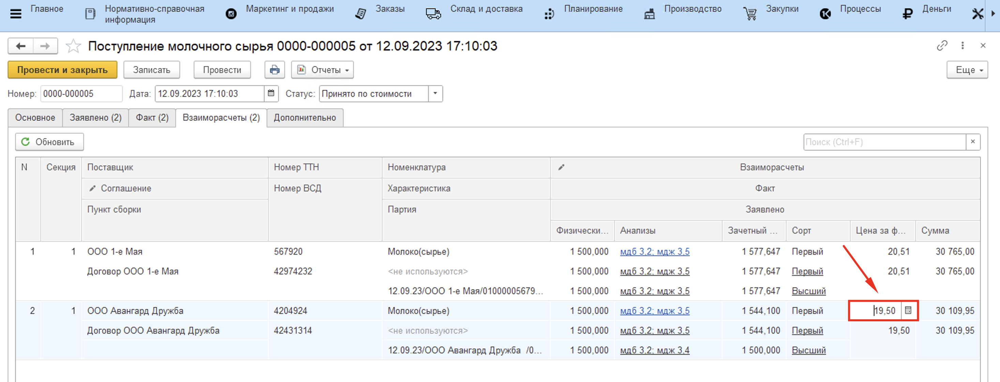

# Расчет стоимости поступившего молока

Расчет стоимости поступающего молока происходит автоматически в
документах **"Поступление молочного сырья"**, на основании заранее
[заведенной информации](../DataFilling/readme.md) в системе.

Открыв любой готовый документ, можно посмотреть полученную стоимость принятого молока: на вкладке *"Взаиморасчеты"* столбец *"Цена за физ. вес"*.

При этом цена, получившаяся на основании различной информации, учтенной в системе, и цена, по которой будут произведены взаиморасчеты, могут отличаться. Автоматически эти цены ставятся одинаковыми. Но в любом документе цену взаиморасчетов можно изменить вручную, тогда итоговая сумма также будет пересчитана:

