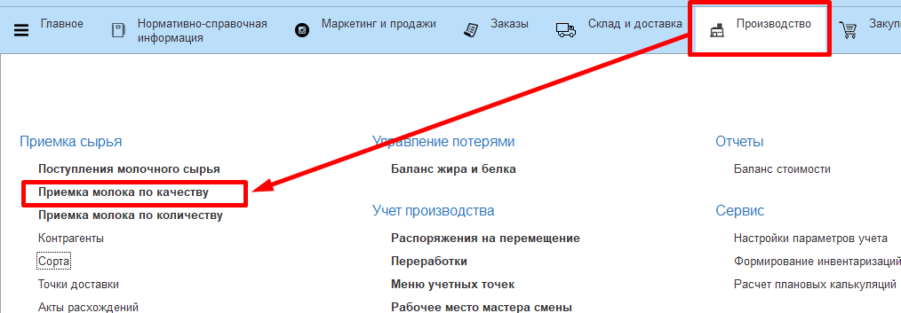
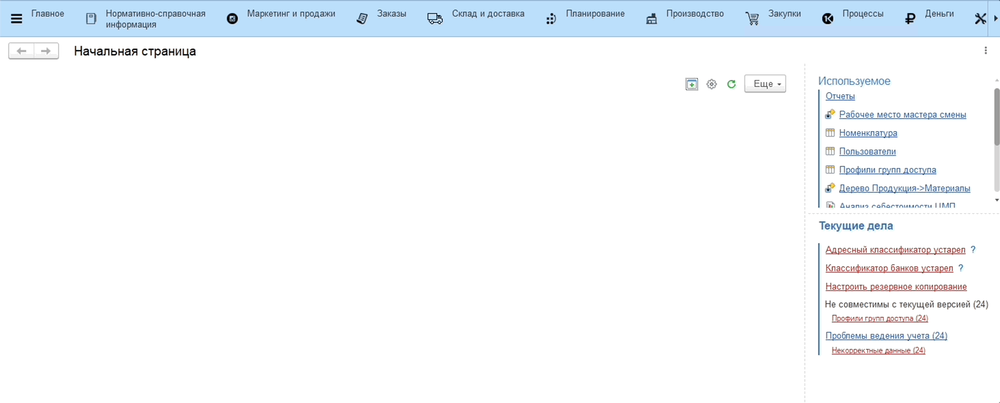
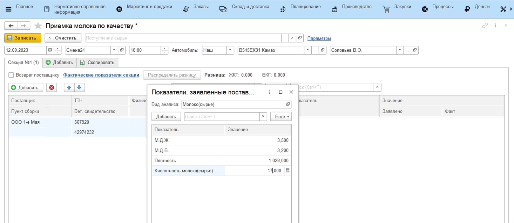
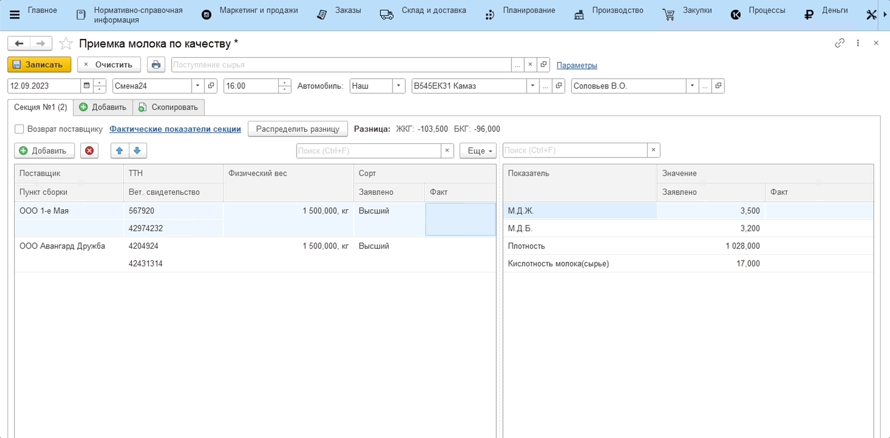
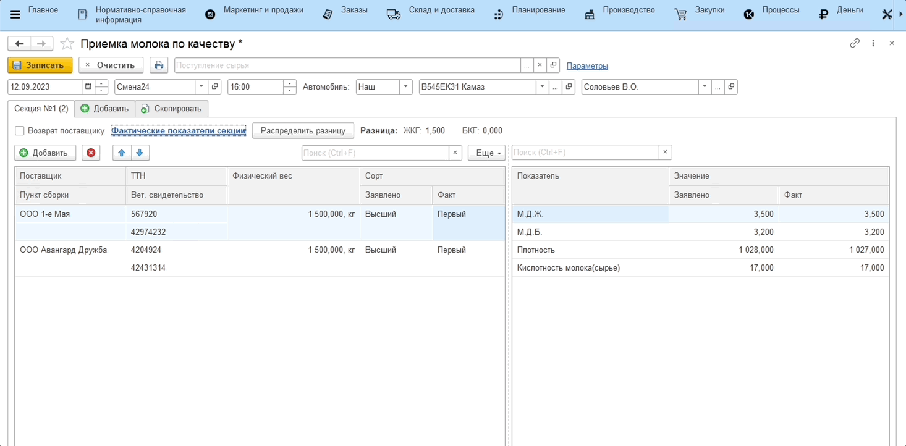

# Учет лабораторных анализов принимаемого молока

Первым этапом при приемке молока является учет лабораторных анализов. Для этого откроем рабочее место **"Приемка молока по качетву"**, относящееся к подсистеме **"Производство"**:

### Шаг 1. Заполнение параметров и основной информации

1. Откроем рабочее место **"Приемка молока по качеству"**;
2. Заполним параметры, которые включают:
    - Организацию;
    - Участок приемки молока;
    - Вид анализа принимаемого молока, содержащий список необходимых к внесению показателей;
    - Номенклатуру, отвечающую за принимаемое сырье.  
3. На основной вкладке заполним информацию о текущей смене, указав дату и смену, и о принимаемой машине с молоком, указав номер и водителя;

### Шаг 2. Внесение информации по секциям

Заполним информацию по первой секции:

- Внесем всех поставщиков, чье молоко находится в ней;
- Номер ТТН;
- Номер Вет. свидетельства;
- Заявленный вес по каждому поставщику;
- Заявленные показатели анализов по каждому поставщику, при необходимости.

### Шаг 3. Внесение фактических показателей

Для внесения фактического значения показателей принятого молока с данной секции, необходимо нажать кнопку **"Фактические показатели секции"**. Заполним значение каждого из показателей в открывшейся форме и нажмем **"ОК"**:

Автоматически определяется сорт молока.

Если заявленные и фактические показатели разнятся, можно распределить эту разницу между поставщиками, нажав **"Распределить разницу"**.

В случае обнаружения некачественного молока в какой-либо из секций машины, при заполнении информации по этой секции необходимо установить галочку **"Возврат поставщику"**.

Аналогично необходимо заполнить информацию по остальным секциям в машине.

### Шаг 4. Формирование акта о расхождениях

Чтобы подтвердить факт приемки молока по качеству необходимо нажать **"Записать"**. Даже если выведется сообщение о том, что сорт не удалось определить, при записи данные сохранятся.

При необходимости можно распечатать "Акт о расхождениях", куда подтянется разница по заявленным и фактическим показателям по секциям.

