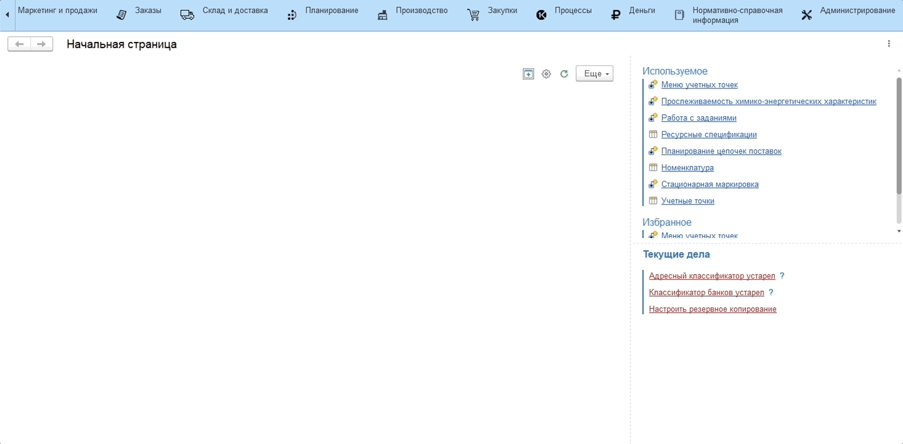
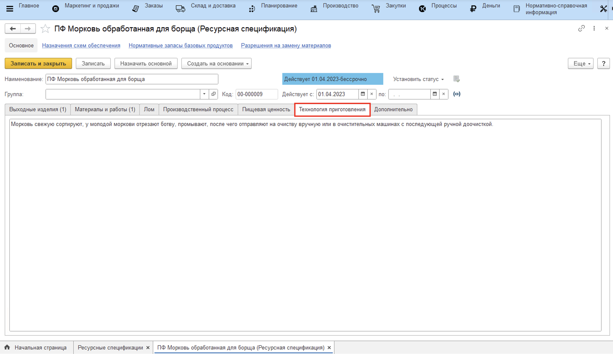

# Расчет пищевой ценности блюда

После внесения [химико-энергетических характеристик для ингредиентов](MaterialsNutritionalValue.md) (номенклатура с типом Сырье), перейдем к расчету пищевой ценности полуфабрикатов, готовых блюд.

Чтобы рассчитать пищевую ценность полуфабриката, готового блюда необходимо следующее:

1. Выберем интересующую нас **"Ресурсную спецификацию"**, выходным изделием которой является номенклатура с типом полуфабрикат или готовый продукт;
2. Перейти на вкладку **"Пищевая ценность"**;
3. В строке **"Выходное изделие"** выберем номенклатуру выходного изделия, для которой хотим рассчитать пищевую ценность;
4. По кнопке **"Заполнить ХЭХ"** автоматически рассчитываются химико-энергетические характеристики по тем материалам, которые используются на выпуск выбранного выходного изделия. При необходимости, характеристики можно скорректировать вручную;
5. Нажимаем кнопку **"Назначить основной"**, данные по характеристикам сохраняются.

## Технология приготовления

При необходимости сохранить информацио о технологии приготовления блюда откроем **"Ресурсную спецификацию"**, вкладка **"Технология приготовления"**.

В текстовом поле введем способ приготовления:

Для сохранения нажмем кнопку **"Записать"**.
