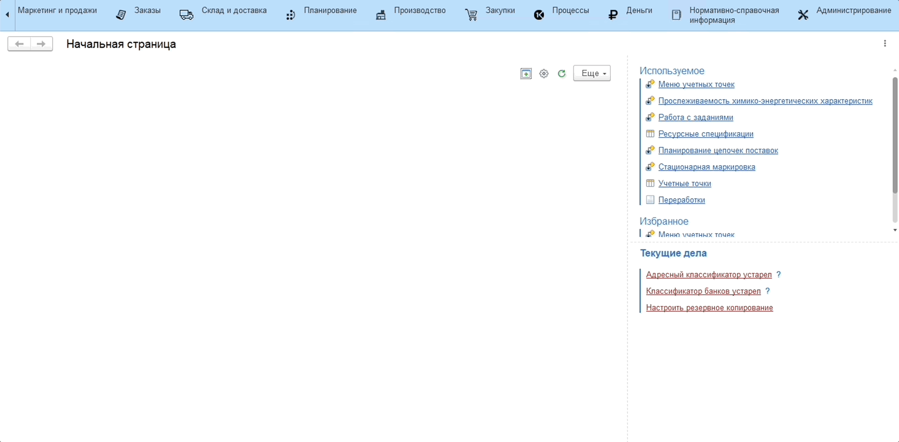

# Формула расчета калорийности

Для автоматического расчета химико-энергетической характеристики - **"Калорийность"**, необходимо задать формулу.

Для этого необходимо:

1. Перейти в подсистему **"Производство"** - **"Настройки параметров учета"**;
2. Выбрать из списка или создать формулу расчета калорийности.

При заведении новой формулы открывается окно создания. Справа отображаются существующие в системе химико-энергетические характеристики, которые необходимо использовать при задании формулы.

