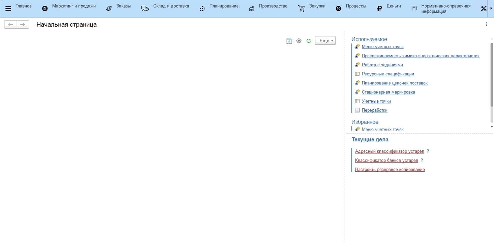

# Химико-энергетические характеристики

Все показатели химико-энергетических характеристик, которые используются для блюд, необходимо отразить в справочнике **"Химико-энергетические характеристики"**.

В него уже занесены основные характеристики, включающие КБЖУ (калории, белки, жиры и углеводы), витамины и микроэлементы.

Для добавления новой характеристики необходимо:

1. Перейти в справочник **"Химико-энергетические характеристики"**;
2. По кнопке **"Создать"** указать:
    - Наименование - название характеристики;
    - Группу ХЭХ - группа химико-энергетических характеристик, соответсвующая данной;
    - Еденицу измерения.
3. Нажать кнопку **"Записать"**.

