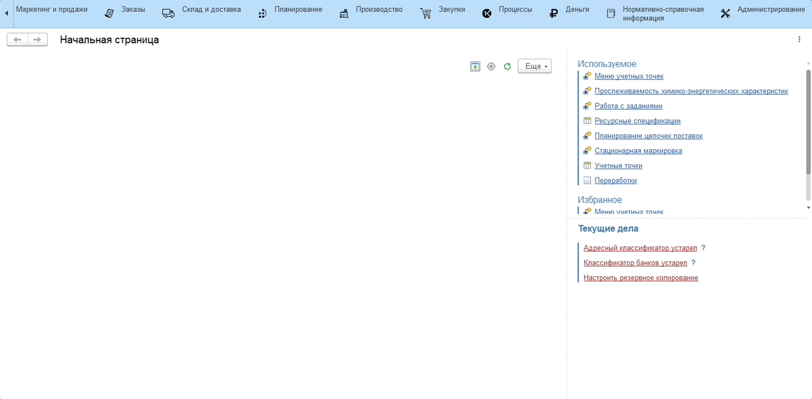

# Группы химико-энергетических характеристик

Созданные [химико-энергетические характеристики](EnergyCharacteristics.md) можно объединять в группы, соответствующие тем наборам характеристик, которые относятся к одному виду.

Для создания новой группы необходимо:

1. Перейти в справочник **"Группы химико-энергетических характеристик"**;
2. По кнопке **"Создать"** указать:
    - Наименование - название группы;
3. Нажать кнопку **"Записать"**.

