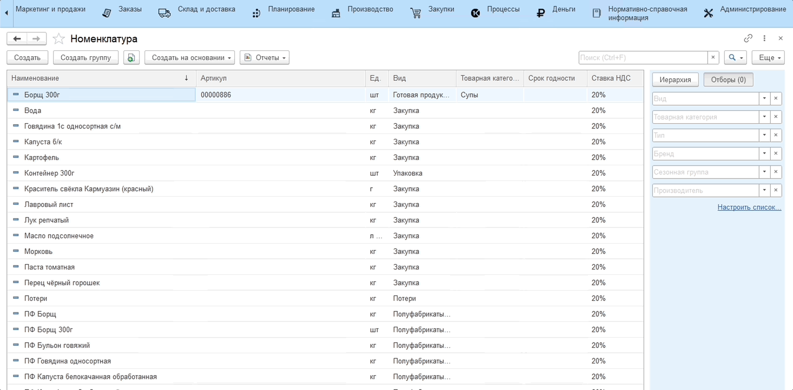

# Пищевая ценность сырья

Первым этапом в расчете пищевой ценности является внесение химимко-энергетических характеристик для ингредиентов (сырья) блюда вручную.

!!! info "Примечание"
        Номенклатура ингредиента для которой указываются химико-энергетические характеристики должна иметь тип номенклатуры **Сырье**.

Для это необходимо выполнить следующие шаги:

1. Выберем номенклатуру ингредиента с типом "Сырье";
2. По кнопке **Перейти** выберем **Химико-энергетические характеристики**;
3. В открывшемся окне по кнопке **Добавить** указываем известные химико-энергетические характеристики и их количество в расчете на 100г;
4. По кнопке **Рассчитать** система автоматически рассчитывает калорийность ингредиента. При необходимости ее можно скорректировать, указав новое значение в поле количество;
5. Сохраним данные нажав на кнопку **Записать**.

