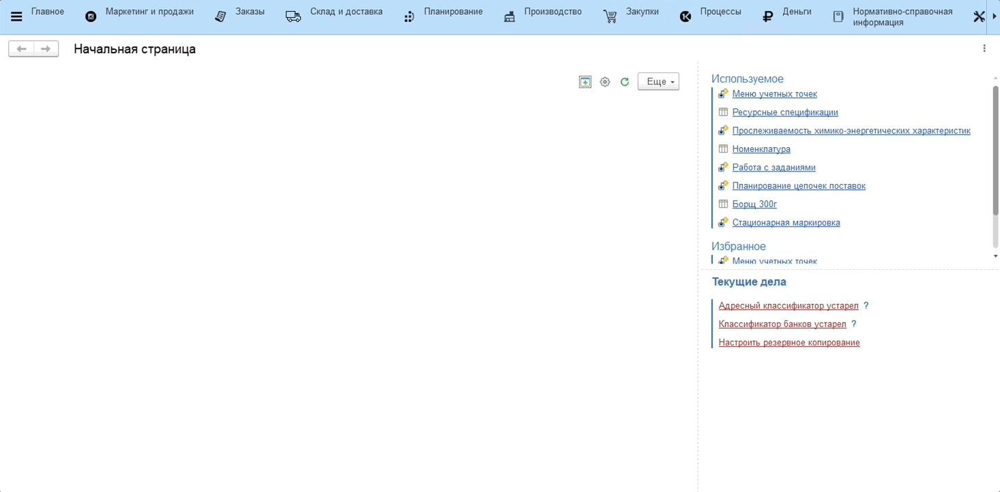

# Прослеживаемость химико-энеретических характеристик

Дерево прослеживаемости химико-энергетических характеристик позволяет по заданному количеству полуфабриката, готового продукта пересчитывать необходимое для приготовления количество материалов.

Также оно позволяет прослеживать основные химико-энергетические характеристики КБЖУ (калории, белки, жиры и углеводы).

Для разузлования необходимо:

1. Перейти в подсистему **"Производство"** - **"Прослеживаемость химико-энергетических характеристик"**;
2. Выбрать номенклатуру полуфабриката или готового продукта;
3. Для номенклатур, имеющих характеристику, выбрать необходимую;
4. Ввести количество;
5. Нажать кнопку **"Обновить"**, автоматически рассчитается дерево от выбранной продукции до необходимых для ее приготовления материалов.

При необходимости можно распечатать дерево в виде таблице, нажав на кнопку **"Печать"**.
