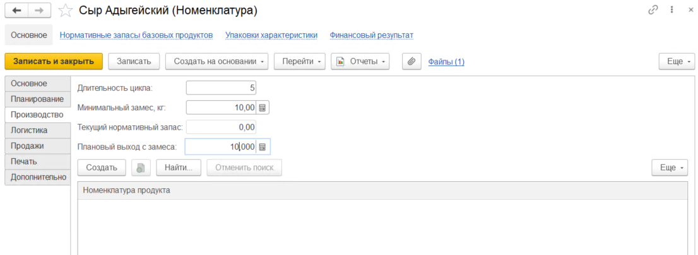
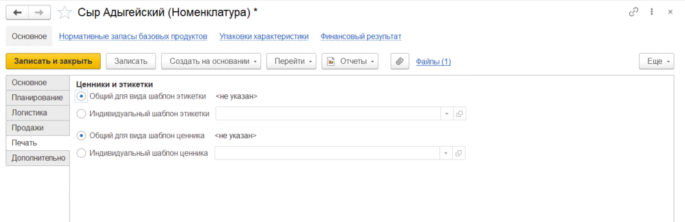

# Номенклатура

В справочнике **"Номенклатура"** хранится весь ассортимент продукции.

**Вкладка "Основное"**

- Папка номенклатуры (используется для разделения номенклатуры в общем списке)
- Код (заполняется автоматически)
- Артикул
- Наименование - рабочее и для печати
- [Вид номенклатуры](KindOfNomenclature.md)
- Использование характеристик (заполняется по виду номенлатуры)
- Использование серий  (заполняется по виду номенлатуры)
- Тип номенклатуры: готовая продукция, базовый продукт, упаковка, сырье, тара, многооборотная тара
- Использование упаковок: индивидуальный набор, общий набор
- Единица хранения
- Дополнительные единицы измерения
- Изображение
- Текстовое описание

**Вкладка "Планирование"**

- Использование в планировании - этот признак устанавливается для той номенклатуры, которая должна попасть в планирование по SKU
- Производитель
- Бренд
- [Товарная категория](РroductCategory.md)
- Сезонная группа
- [Склад выпуска](Warehouse.md)

**Вкладка "Производство"**

Появляется для номенклатуры с типом номенклатуры *"Базовый продукт"*

- Длительность цикла
- Минимальный замес в килограммах
- Текущий нормативный запас
- Плановый выход с замеса
- Табличная часть, содержащая список готовой продукции, производимой из данного базового продукта

**Вкладка "Продажи"**

- Признак продажи сезонно
- Дата ввода в продажу
- Дата вывода из продажи
- Ставка НДС: 20%, 18%, 10%, 0%, Без НДС

**Вкладка "Логистика"**

- Упаковка по умолчанию
- Кратность

**Вкладка "Печать"**

- Шаблон этикетки
- Шаблон ценника

**Вкладка "Дополнительно"**

- Признак использования сертификатов номенклатуры
- Признак "Социально-значимый товар"
- Срок годности в днях (неделях, месяцах, годах)
- Сырьевая статья затрат
- Правило округления: не округлять, в большую сторону, в меньшую сторону, математически
- Разрядность округления (если выбрано правило)
- Гиперссылка на Виды анализов качественных показателей
- Гиперссылка на Штрихкоды
- Комментарий