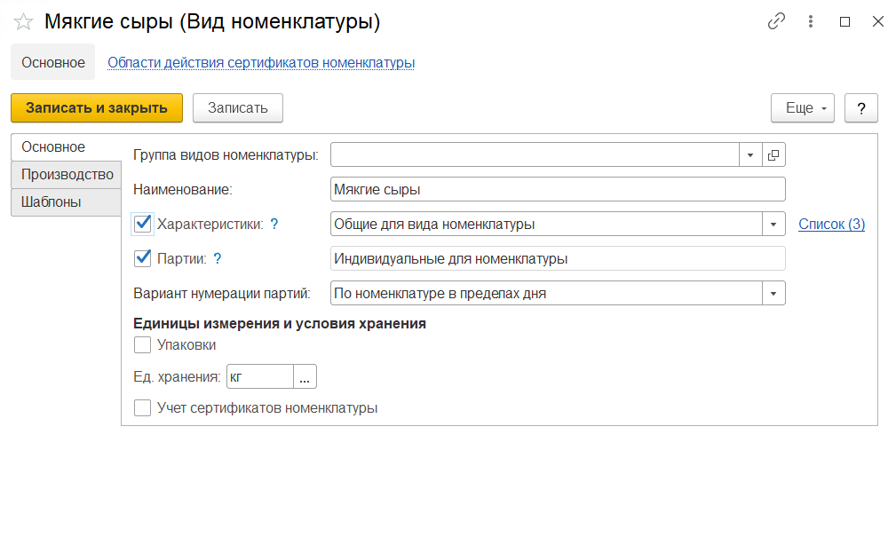

# Виды номенклатуры

Справочник **"Виды номенклатуры"** предназначен для группировки продаваемых товаров по ассортименту. Виды номенклатуры объединяют номенклатуру по общим признакам учета, таким как учет по характеристикам и сериям.

**Вкладка "Основное"**

- Группа видов номенклатуры (группа, в которую входит данный вид номенклатуры)
- Наименование
- Использование характеристик : индивидуальные для номенклатуры, общие для вида номенклатуры. При включении справа появится гиперссылка на список характеристик, общих для этого вида номенклатуры
- Использование серий
- Вариант нумерации серий: по номенклатуре в пределах дня, по номенклатуре в пределах года
- Использование упаковок: индивидуальный набор, общий набор
- Единица хранения
- Учет сертификатов номенклатуры (признак копируется в номенклатуру)

**Вкладка "Производство"**

- Тип: пакет, прочее, сырье и материалы, короб, полуфабрикат, готовая продукция
- Тип воспроизводства: производство, покупка
- Сырьевая статья затрат
- Гиперссылка на Виды анализов качественных показателей - доступна, если включен учет по сериям - определяет набор видов анализов, выполняемых по данному виду номенклатуры

**Вкладка "Шаблоны"**

Видна, если включен учет по сериям.

В шаблоне задается вид серий номенклатуры.