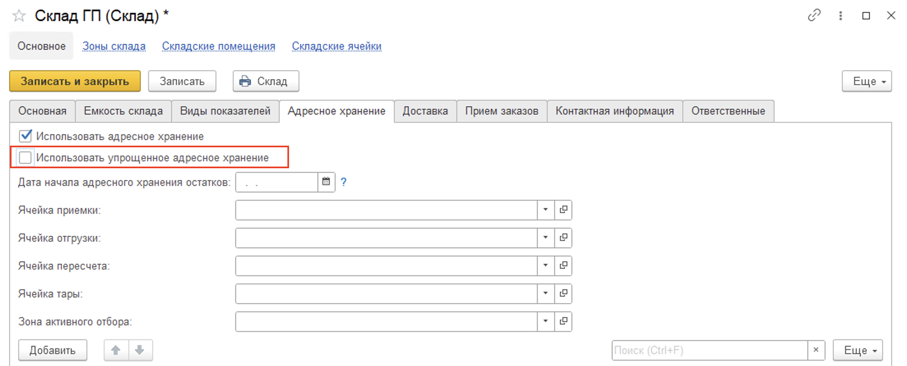

# Упрощенный адресный склад

Для любого адресного склада доступна функциональная настройка **"Использовать упрощенное адресное хранение"**. Данная опция позволяет автоматически настроить адресный склад, использующий только две ячейки: приемки (хранения) и отгрузки.

Данный формат адресного склада подойдет для случаев, когда на складах отсутствует размещение по ячейкам, однако есть области сортировки и отбора продукции, а также соответствующие складские операции: приемка, отбор и отгрузка.

При включении данной опции система автоматически предложит создать ячейки приемки и отгрузки. 

